# Autonomous Copilot Agent with External Mailbox Integration and Workflow Support

An autonomous coding agent built with GitHub Copilot SDK that can work on tasks for extended periods using an external mailbox protocol for task assignment and communication.

## Quick Links

- **[Quick Start Guide](QUICKSTART.md)** - Get the agent running in 5 minutes
- **[Workflow Hello World](WORKFLOW_HELLO_WORLD.md)** - Create your first workflow in 30 minutes
- **[Config Validator](CONFIG_VALIDATOR.md)** - Validate config.json before running
- **[A2A Protocol Integration](A2A_INTEGRATION.md)** - HTTP-based inter-agent communication
- **[Workflow Schema](workflows/workflow.schema.json)** - Complete workflow field reference
- **[Smoke Tests](smoke_tests/)** - Complete working examples

## Architecture

The following diagram depicts the autonomous agent architecture and general flow. 



---

The following diagram depicts the flow of work items through the autonomous agent.
An external mailbox message (assignment) will get decomposed into work items and written to disk.
While work items exist on disk, the agent will work trough them and move to complete.



## Design Philosophy

**Validation is intentionally NOT built into the agent.** Verification is a workflow-specific concern - you define QA states/agents in your workflows as needed. This provides flexibility: PoCs can skip verification, production systems can add dedicated QA states, regulatory environments can implement multi-stage review processes. The agent executes workflows; workflows define quality gates.

## Features

- **Autonomous task processing** - Runs continuously, checks mailbox periodically
- **Folder-based mailbox** - Plain directories by default; enable `gitSync` for multi-agent remote collaboration
- **External mailbox protocol** - File-based mailbox protocol for multi-agent coordination
- **A2A protocol support** - HTTP-based Agent2Agent (A2A) protocol runs alongside the mailbox for cross-network agent communication; add a `communication.a2a` block to enable both concurrently with FIFO timestamp ordering
- **Broadcast messages** - Support for `to_all/` team-wide messages
- **Attachments support** - Share files via `attachments/` folder
- **JSON configuration** - Flexible config file for all settings
- **Custom tools** - Mailbox operations, file management, testing
- **Session persistence** - Maintains context across runs
- **Error handling** - Automatic escalation when stuck
- **Logging** - Detailed activity logs for monitoring

## Setup

### Prerequisites

1. **GitHub Copilot Subscription** - Individual, Business, or Enterprise plan

2. **GitHub Copilot CLI** installed and authenticated:
   ```bash
   # Check CLI is installed (we're using it right now!)
   # If needed, see: https://docs.github.com/en/copilot/using-github-copilot/using-github-copilot-in-the-command-line
   
   # Verify authentication status
   # The agent uses your existing CLI authentication automatically
   # No separate login needed!
   ```

3. **Node.js** LTS installed:
Modern Node.js LTS versions are required for Copilot and Copilot SDK. 
   ```bash
   node --version
   ```

### Authentication

**The agent uses your existing Copilot CLI authentication** - no separate login required!

The `@github/copilot-sdk` automatically connects to your authenticated Copilot CLI. Just make sure you're logged in.

#### FREE Models (Recommended for Autonomous Agents)

If you have a **paid Copilot plan**, these models are **FREE and UNLIMITED**:

```json
{
  "copilot": {
    "model": "gpt-4.1"    // FREE! No quota limits
    // Also FREE: "gpt-4o", "gpt-5-mini"
  },
  "quota": {
    "enabled": false      // Disable for FREE models
  }
}
```

These don't count against your premium request quota, making them perfect for autonomous agents that run for hours.

#### Premium Models (Quota Tracking Enabled)

For premium models like `claude-sonnet-4.5` or `claude-opus-4.5`, enable quota tracking:

```json
{
  "copilot": {
    "model": "claude-sonnet-4.5"
  },
  "quota": {
    "enabled": true,
    "preset": "conservative"  // See QUOTA.md for strategies
  }
}
```

See `QUOTA.md` for detailed quota management strategies.

### Installation

```bash
npm install
```

### Quick Scaffold

The fastest way to get started is the init command:

```bash
npm run init
```

This creates a minimal `config.json`, a mailbox folder with inbox and archive
directories, and seeds a hello-world task so the first `npm start` has work
to do. For CI or Docker, use `npm run init -- --non-interactive`.

To wipe runtime state and start over:

```bash
npm run reset            # prompts before removing workspace, mailbox, logs
npm run reset -- --full  # also removes config.json for a complete re-scaffold
```

### Manual Configuration

Alternatively, create `config.json` by hand with only the two required fields:

```json
{
  "agent": { "role": "developer" },
  "mailbox": { "repoPath": "./mailbox" }
}
```

Everything else has sensible defaults (see `src/config-defaults.ts`).
The full effective configuration is logged on every startup.

> [!NOTE]
> The mailbox is a plain folder by default. No git repository is required.
> Set `"gitSync": true` when agents share a remote mailbox for multi-agent
> collaboration.
```

See `config.example.json` for full configuration options with documentation.

**Validate your config:**

```bash
# Validate config.json before running
npx tsx scripts/validate-config.ts

# Or validate a custom config
npx tsx scripts/validate-config.ts path/to/custom-config.json
```

The validator checks:
- Required sections and fields
- Field types and enums (role, validation mode, log level, priority)
- Numeric ranges (intervals, timeouts)
- File path references (roles file, workflow file, mailbox path)
- Permission policies

Exit code 0 = valid, 1 = errors found.

### Copilot Instructions Generation (`roles.json` + `custom_instructions.json`)

Each agent generates a `.github/copilot-instructions.md` file at startup. This
file tells the Copilot SDK how the agent should behave -- its role, tools,
workflows, and coding standards. The instructions are composed from two layers:

```
roles.json (generic)          custom_instructions.json (project-specific, optional)
========================      =====================================================
Role identity (Developer,     Git workflow (branch conventions, merge rules)
  QA, Manager, Researcher)    Coding standards (language, pre-commit checklist)
Primary responsibilities      Build system (build/test/lint/format commands)
Out-of-scope boundaries       Project context (domain-specific notes)
Escalation triggers           Additional sections (custom headings/items)
QA verification workflow
Manager delegation rules
Rework/rejection handling
```

**`roles.json`** lives in the `autonomous_copilot_agent/` root and defines
what each role IS -- responsibilities, boundaries, escalation triggers, and
generic workflow patterns. This file is shared across all deployments and
should not contain project-specific content.

**`custom_instructions.json`** is an optional per-agent overlay that adds
project-specific content. Place it next to the agent's `config.json` and
reference it in the config:

```json
{
  "agent": {
    "role": "developer",
    "customInstructionsFile": "./custom_instructions.json"
  }
}
```

If `customInstructionsFile` is not set, the generator looks for
`custom_instructions.json` in the same directory as `roleDefinitionsFile`.
If no file is found, instructions generate cleanly with just the base role.

#### `custom_instructions.json` Schema

| Field | Type | Description |
|-------|------|-------------|
| `gitWorkflow` | `{ [role]: { description, steps[], rules[] } }` | Git branching/merge workflow per role. Only the matching role's section is rendered. |
| `codingStandards` | `{ language, description?, preCommitChecklist[], sections: { [heading]: string[] } }` | Language-specific coding standards. The `language` field becomes the section heading (e.g., "Rust Coding Standards"). `sections` is a map of heading -> bullet items. |
| `buildSystem` | `{ buildCommand, testCommand, lintCommand, formatCommand }` | Build/test/lint commands for QA verification. |
| `projectContext` | `string[]` | High-level project context lines rendered under "Project Context". |
| `additionalSections` | `{ title, items[] }[]` | Arbitrary extra sections appended to the instructions. |

#### Example: Rust Project with Git Workflow

```json
{
  "codingStandards": {
    "language": "Rust",
    "description": "Mandatory quality gates for all Rust code.",
    "preCommitChecklist": [
      "1. cargo fmt -- format all code",
      "2. cargo clippy -- -D warnings -- fix ALL warnings",
      "3. cargo build -- must compile cleanly",
      "4. cargo test -- all tests must pass"
    ],
    "sections": {
      "Documentation": [
        "Every public fn, struct, enum, trait MUST have a /// doc comment",
        "Every unsafe block MUST have a // SAFETY: comment"
      ],
      "Error Handling": [
        "Use Result<T, E> for fallible operations -- never unwrap() in library code",
        "Propagate errors with ? -- avoid swallowing errors silently"
      ]
    }
  },
  "gitWorkflow": {
    "developer": {
      "description": "One task at a time. Push to feature branch, wait for QA.",
      "steps": ["1. git checkout -b dev/<task>", "2. Implement and push"],
      "rules": ["ONE branch at a time", "You do NOT merge to main"]
    }
  },
  "projectContext": [
    "FDA-regulated medical device data platform",
    "HIPAA-compliant -- all PHI access must be audit-logged"
  ]
}
```

#### Example: Python Project (No Git Workflow)

```json
{
  "codingStandards": {
    "language": "Python",
    "description": "PEP 8 and type safety.",
    "preCommitChecklist": [
      "1. black . -- format all code",
      "2. ruff check . -- fix all lint warnings",
      "3. mypy . -- type check must pass",
      "4. pytest -- all tests must pass"
    ],
    "sections": {
      "Type Safety": [
        "All public functions MUST have type annotations",
        "Use TypedDict for complex dictionary shapes"
      ]
    }
  },
  "buildSystem": {
    "testCommand": "pytest",
    "lintCommand": "ruff check .",
    "formatCommand": "black ."
  }
}
```

When `gitWorkflow` is omitted, the developer instructions skip the git
workflow section entirely. This is correct for projects that do not use
the dev/QA/merge pipeline.

#### Regenerating Instructions

Instructions are regenerated automatically on agent startup and whenever
`config.json`, `roles.json`, or `custom_instructions.json` changes (via the
config watcher). To regenerate manually:

```bash
# From the autonomous_copilot_agent directory:
npx tsx scripts/generate-instructions.ts <path-to-config.json>

# Example for the developer agent:
npx tsx scripts/generate-instructions.ts \
  ../agents/developer/agent/config.json
```

The script reads `workspace.path` from the config to determine where to
write `.github/copilot-instructions.md`.

See `custom_instructions.example.json` for the full schema with all fields.

### Work Item Decomposition (`minWorkItems`, `maxWorkItems`)

When the agent receives a task, it uses the LLM to decompose it into
sequential work items. The `minWorkItems` and `maxWorkItems` settings control
the range the LLM is instructed to target:

```json
{
  "agent": {
    "minWorkItems": 5,     // Minimum work items per task (default: 5)
    "maxWorkItems": 20     // Maximum work items per task (default: 20)
  }
}
```

Both fields are optional. When omitted, the agent defaults to 5-20.

**Tuning guidance:**

| Scenario | Suggested Range | Rationale |
|----------|----------------|-----------|
| Large capable model (gpt-4.1, claude-sonnet-4) | 5-12 | Fewer, broader items -- the model handles complexity within each item. Faster execution, fewer SDK round-trips. |
| Smaller / less capable model (gpt-5-mini) | 8-20 | More granular items reduce per-item complexity so the model can succeed at each step. Trades speed and tokens for reliability. |
| Manager (delegation only) | 3-6 | Each item is a delegation message, not implementation work. Fewer items = fewer inter-agent messages. |
| Quick tasks / hotfixes | 2-5 | Small tasks don't need 20 items. Keeps overhead proportional. |

**Key trade-off:** More granular decomposition (higher min/max) gives less
capable models a better chance of completing each step correctly, at the cost
of more SDK calls, more tokens, and longer wall-clock time. Start with
defaults and adjust based on observed success rates in your logs.

## Usage

### Quick Start

1. **Install dependencies:**
   ```bash
   npm install
   ```

2. **Configure the agent:**
   ```bash
   cp config.example.json config.json
   nano config.json
   ```
   
   Set at minimum:
   - `agent.role` - Your agent's role (developer, qa, manager, researcher)
   - `mailbox.repoPath` - Path to the mailbox directory

3. **Run the agent:**
   ```bash
   npm start
   ```

The agent will now:
- Check the mailbox every 30 minutes (configurable)
- Process any new task assignments
- Execute work autonomously using Copilot
- Send completion reports
- Track quota usage (if enabled)

### Sending Tasks to the Agent

The agent monitors messages in the mailbox. To assign a task:

1. **Create a message file** in the mailbox:
   ```bash
   # Recommended: Use UTC timestamp prefix for unique, chronological ordering
   # Format: YYYY-MM-DD-HHMM_subject.md
   # Example: 2026-01-30-2145_implement_user_auth.md
   
   # Alternative: Sequential numbering (001_, 002_, etc.)
   # Simpler but requires coordination to avoid conflicts
   ```

2. **Message format** (with headers):
   ```markdown
   Date: 2026-01-30T21:45:00Z
   From: i9_manager
   To: mbp16_developer
   Subject: Implement user authentication
   Priority: HIGH
   
   Please implement OAuth authentication for the user login system.
   
   Requirements:
   - Support Google and GitHub OAuth
   - Store tokens securely
   - Add logout functionality
   - Write tests
   
   Acceptance Criteria:
   - [ ] OAuth flow works for both providers
   - [ ] Tests pass
   - [ ] Documentation updated
   ```

3. **Place in the correct folder**:
   ```bash
   mailbox/to_mbp16_developer/2026-01-30-2145_implement_user_auth.md
   ```

4. **Commit and push** (only when `gitSync` is enabled):
   ```bash
   cd path/to/mailbox
   git add .
   git commit -m "Assign OAuth task to developer"
   git push
   ```

5. **Agent processes it** on next check:
   - Reads the task
   - Works on implementation
   - Sends completion report
   - Archives the message

### Monitoring the Agent

**View real-time logs:**
```bash
tail -f logs/agent.log
```

**Check quota usage:**
```bash
npm run quota-status
```

**Check agent state:**
```bash
cat workspace/session_context.json
```

**Check quota state:**
```bash
cat workspace/quota_state.json
```

### Manual Operations

**Check mailbox once (no loop):**
```bash
npm run check-mailbox
```

**Regenerate role instructions:**
```bash
npm run generate-instructions
```

### Development mode (with hot reload):

```bash
npm run dev
```

## Multi-Agent Team Setup

To run a team of agents (e.g., manager + developer + QA), each agent runs on its own machine (or terminal) with its own `config.json`, sharing a single mailbox directory. For remote collaboration across machines, enable `gitSync: true` and back the mailbox with a shared git repository.

### 1. Create a Shared Mailbox

For a local team (same machine or shared filesystem):

```bash
mkdir -p shared-mailbox/mailbox/to_all
```

For a remote team (different machines), initialize a git repo:

```bash
mkdir shared-mailbox && cd shared-mailbox && git init
mkdir -p mailbox/to_all
git remote add origin <your-git-url>
git add . && git commit -m "Init mailbox" && git push -u origin main
```

### 2. Clone the Agent on Each Machine

```bash
git clone <agent-repo-url> autonomous_copilot_agent
cd autonomous_copilot_agent && npm install
```

For remote teams, also clone the shared mailbox:

```bash
git clone <mailbox-repo-url> ../shared-mailbox
```

### 3. Configure Each Agent

**Manager** (`config.json` on machine A):
```json
{
  "agent": {
    "hostname": "machine-a",
    "role": "manager",
    "checkIntervalMs": 60000
  },
  "mailbox": { "repoPath": "../shared-mailbox", "gitSync": true },
  "manager": { "hostname": "machine-a", "role": "manager" }
}
```

**Developer** (`config.json` on machine B):
```json
{
  "agent": {
    "hostname": "machine-b",
    "role": "developer",
    "checkIntervalMs": 60000
  },
  "mailbox": { "repoPath": "../shared-mailbox", "gitSync": true },
  "manager": { "hostname": "machine-a", "role": "manager" }
}
```

**QA** (`config.json` on machine C):
```json
{
  "agent": {
    "hostname": "machine-c",
    "role": "qa",
    "checkIntervalMs": 60000
  },
  "mailbox": { "repoPath": "../shared-mailbox", "gitSync": true },
  "manager": { "hostname": "machine-a", "role": "manager" }
}
```

### 4. Start Each Agent

On each machine:
```bash
npm start
```

The team will now coordinate via the shared mailbox:
- **Manager** receives tasks from the user, delegates via `send_message()`
- **Developer** picks up assignments, implements, sends completion reports
- **QA** picks up completion reports, runs build/test/lint, sends pass/fail back
- **Developer** handles any QA rejections (rework loop)
- **Manager** receives escalations and final status

See `ROLES.md` for detailed role definitions and `smoke_tests/multi-agent/` for a working example.

### A2A Protocol (Always-On)

For teams that need HTTP-based inter-agent communication across network boundaries, the agent supports the Agent2Agent (A2A) protocol running alongside the git mailbox. Both backends are always active when configured -- incoming messages are merged into a single FIFO queue ordered by timestamp (earliest first). Add a `communication.a2a` block to `config.json`:

```json
{
  "communication": {
    "a2a": {
      "serverPort": 4000,
      "transport": "json-rpc"
    }
  }
}
```

With this configuration the agent receives task assignments from both the git mailbox and the A2A HTTP server. Incoming A2A assignments are persisted as timestamped files in `a2a_inbox/` and archived to `a2a_archive/` after completion.

See [A2A_INTEGRATION.md](A2A_INTEGRATION.md) for full configuration options, the component architecture, and the `smoke_tests/a2a/` example.

```
autonomous_copilot_agent/
├── src/
│   ├── agent.ts              # Main autonomous agent loop
│   ├── mailbox.ts            # Mailbox operations (read, write, archive)
│   ├── tools/                # Custom Copilot tools
│   │   ├── mailbox-tools.ts  # Mailbox checking/archiving tools
│   │   ├── file-tools.ts     # File operations
│   │   └── test-tools.ts     # Testing/verification tools
│   ├── types.ts              # TypeScript type definitions
│   └── utils.ts              # Utility functions
├── workspace/                # Agent working directory
├── logs/                     # Activity logs
├── package.json
├── tsconfig.json
└── README.md
```

## How It Works

1. **Agent starts** and loads configuration from `config.json`
2. **Git sync** (if enabled) pulls latest messages from the remote repository
3. **Every N minutes**, agent checks mailbox for new messages (including `to_all/`)
4. **If new task found**:
   - Parse task requirements
   - Create Copilot session with task context
   - Execute work using available tools
   - Run tests/verification
   - Send completion report to mailbox
   - Archive processed message
   - Git commit and push changes
5. **If stuck**, escalate to manager after timeout
6. **Save context** and continue monitoring

## Custom Tools

The agent has access to:

- `check_mailbox` - Check for new task assignments
- `archive_message` - Move processed messages to archive
- `send_message` - Send status updates or completion reports
- `send_broadcast` - Send team-wide broadcast to `to_all/`
- `read_file` - Read files from workspace
- `write_file` - Create/modify files
- `run_tests` - Execute test suites
- `git_operations` - Git commit, status, diff

## Monitoring

View real-time logs:

```bash
tail -f logs/agent.log
```

Check agent status:

```bash
cat workspace/session_context.json
```

## Safety Features

- **Timeout protection** - Escalates if stuck on task >30 minutes
- **Tool allowlist** - Only approved tools can be called
- **Workspace isolation** - Agent works in sandboxed directory
- **Dry-run mode** - Test without executing (coming soon)

## Integration with Multi-Agent Workflows

The agent uses a file-based mailbox protocol:

- Reads from: `mailbox/to_{hostname}_{role}/`
- Archives to: `mailbox/to_{hostname}_{role}/archive/`
- Message format: `YYYY-MM-DD-HHMM_subject.md`

For single-agent use, the mailbox is a plain directory. For multi-agent
collaboration across machines, enable `gitSync: true` and back the mailbox
with a shared git repository.

### Workflow Construction Guide

**New to workflows? Start here:** [Workflow Hello World Tutorial](WORKFLOW_HELLO_WORLD.md) - Create your first workflow in 30 minutes and understand the core concepts.

A **workflow** is a JSON state machine that orchestrates multi-agent task
execution. Each state declares which role performs the work, what the agent
should do, and where to transition on success or failure. The regulatory
smoke test (`smoke_tests/regulatory/`) is the reference implementation of
a full V-model workflow.

#### Anatomy of `workflow.json`

```
workflow.json
├── id, name, version          -- Metadata
├── initialState               -- Where task execution begins
├── terminalStates             -- ["DONE", "ESCALATED"]
├── globalContext               -- Shared variables (branch, paths, thresholds)
└── states
    ├── STATE_A
    │   ├── role               -- Which agent handles this state
    │   ├── prompt             -- What the LLM is told to do
    │   ├── onEntryCommands    -- Deterministic shell commands run before work
    │   ├── onExitCommands     -- Deterministic shell commands run after work
    │   ├── exitEvaluation     -- LLM-answered yes/no gate before transition
    │   ├── transitions        -- { onSuccess, onFailure }
    │   ├── maxRetries         -- Retry count before escalation
    │   └── timeoutMs          -- Per-state timeout
    └── STATE_B ...
```

#### Design Patterns

**1. Linear pipeline (A -> B -> C -> DONE)**

Each state transitions `onSuccess` to the next state. Simplest pattern.
Good for build-test-deploy or document-review-publish flows.

**2. V-model with rework loops (regulatory example)**

```
RA(REQUIREMENTS) -> Dev(IMPLEMENTING) -> QA(VERIFICATION) -> RA(ACCEPTANCE) -> DONE
                         ^                    |
                         |                    v
                         +--- REWORK <--------+
```

QA verification uses `exitEvaluation` to gate the transition. On failure,
the workflow routes to REWORK (assigned to the developer role), which loops
back to VERIFICATION. This enforces quality without manual intervention.

**3. Peer routing (no manager)**

Agents route assignments directly to each other via `teamMembers` in their
config. Each agent's config lists the other agents' hostnames and roles:

```json
{
  "teamMembers": [
    { "hostname": "smoke-reg-dev", "role": "developer" },
    { "hostname": "smoke-reg-qa",  "role": "qa" }
  ]
}
```

The workflow engine matches the state's `role` field to a team member and
sends the assignment via the mailbox. No manager agent is needed in the
routing chain.

#### Step-by-Step: Building a New Workflow

1. **Define states and roles.** Sketch the state machine on paper first.
   Each state needs a unique name, an assigned role, and transitions.

2. **Write prompts.** Each state's `prompt` tells the LLM exactly what to
   produce. Be explicit about file paths, naming conventions, and expected
   artifacts. Reference `{{variable}}` placeholders from `globalContext`.

3. **Add `onEntryCommands` / `onExitCommands`.** Every state that produces
   files should have git fetch/checkout/reset on entry and git add/commit/push
   on exit. This is the single most important reliability pattern -- LLMs
   frequently forget to push. See the schema reference below.

4. **Add `exitEvaluation` to verification states.** Any state that needs a
   pass/fail gate should use `exitEvaluation` instead of relying on regex
   parsing of LLM output. Ask a direct yes/no question.

5. **Set `maxRetries` and `timeoutMs`.** Requirements and acceptance states
   are fast (1 retry, 180s). Implementation and verification need more
   headroom (2 retries, 300s).

6. **Create the smoke test harness.** Each smoke test directory needs:
   - `workflow.json` -- the state machine
   - `setup.sh` -- creates agent dirs, clones origin, seeds first task
   - `run-test.sh` -- builds, starts agents, seeds subsequent tasks
   - `validate.sh` -- checks evidence artifacts after completion
   - `cleanup.sh` -- removes runtime artifacts for a clean re-run
   - `{role}/agent/config.template.json` -- per-agent config template

7. **Wire `globalContext`.** Variables like `branch`, `projectPath`, and
   `complianceLevel` are available to all states via `{{variable}}` in
   prompts and commands. Set them once; agents read them automatically.

   **Important:** The shipped workflow files default to Rust. You **must**
   set `buildCommand`, `testCommand`, and `lintCommand` in `globalContext`
   to match your project's language and toolchain. These values drive every
   mechanical quality gate (`onExitCommands` with `failOnError: true`) and
   are referenced in prompt templates. See
   [workflows/README.md](workflows/README.md#customizing-for-your-language)
   for per-language examples.

#### Common Pitfalls

| Pitfall | Fix |
|---------|-----|
| LLM forgets to `git push` | Always use `onExitCommands` with git add/commit/push |
| Regex misreads "FAIL" in a PASS table | Use `exitEvaluation` with a boolean prompt |
| Race condition between tasks | Seed tasks serially in `run-test.sh` after detecting terminal state |
| Agent starts with stale files | `onEntryCommands`: git fetch + reset --hard origin/branch |
| Evidence from prior tasks overwritten | Prompt the LLM to "append new rows -- do not overwrite" |

### State Entry / Exit Commands (`onEntryCommands`, `onExitCommands`)

Workflow states can define deterministic shell commands that are issued to the
LLM via the Copilot SDK at state entry and exit. Unlike `entryActions` /
`exitActions` (code-level engine actions), these commands are **sent to the LLM
as synthetic work items** so the LLM executes them in a terminal and can adapt
if they fail.

This solves a critical reliability problem: LLMs frequently forget to push
committed work. With `onExitCommands`, every state boundary enforces git
add/commit/push regardless of whether the LLM remembered to do it.

#### Schema

```json
{
  "onEntryCommands": [
    {
      "command": "git fetch origin",
      "reason": "Fetch latest remote refs from other agents.",
      "failOnError": false
    },
    {
      "command": "git checkout {{branch}}",
      "reason": "Switch to branch. Use -b if missing, -f if dirty.",
      "failOnError": false
    },
    {
      "command": "git reset --hard origin/{{branch}}",
      "reason": "Force-sync to origin. Skip if origin/branch missing (fresh repo).",
      "failOnError": false
    }
  ],
  "onExitCommands": [
    {
      "command": "git add -A",
      "reason": "Stage all changes.",
      "failOnError": false
    },
    {
      "command": "git commit -m '{{role}}: {{state}} for {{taskId}}'",
      "reason": "Commit. Use --allow-empty if nothing new.",
      "failOnError": false
    },
    {
      "command": "git push origin {{branch}}",
      "reason": "Push so downstream agents can pull. Critical.",
      "failOnError": false
    }
  ]
}
```

#### Template Variables

All `{{variable}}` placeholders are resolved from the merged task context
(globalContext + accumulated per-state outputs). Additionally, the engine
injects these synthetic variables:

| Variable    | Source                                 |
|-------------|----------------------------------------|
| `taskId`    | Active task identifier                 |
| `role`      | Current state's assigned role          |
| `state`     | Current state name (e.g. IMPLEMENTING) |
| `branch`    | From globalContext (set to "main")     |

#### Execution Model

1. Each command becomes a synthetic `WorkItem` sent to the Copilot SDK
2. The LLM receives the command + human-readable reason as a prompt
3. The LLM executes the command in a terminal and can adapt on failure
4. If `failOnError` is true (default) and the command fails, remaining
   commands in the sequence are skipped
5. Entry commands run after `receiveAssignment()` but before work items
6. Exit commands run after work items complete but before `transition()`

### Exit Evaluation (`exitEvaluation`)

Workflow states can define a structured **exit evaluation** that replaces
regex-based fail detection with a deterministic, LLM-answered question.

After work items complete and before the state transition fires, the engine
sends a constrained prompt to the LLM (e.g., "Did all tests pass? true/false").
The response is parsed and mapped to a `success` or `failure` outcome, which
drives the `onSuccess` / `onFailure` transition.

This solves a fundamental problem: when an LLM produces a verification table
with columns like `| Status |` containing both "Pass" and "Fail" as headers
or row values, regex pattern matching cannot reliably distinguish a failing
verdict from a passing one that merely mentions the word "Fail". Exit
evaluation sidesteps this entirely by asking a direct yes/no question.

#### Schema

```json
{
  "exitEvaluation": {
    "prompt": "Did ALL verification checks pass (annotations found, tests passed, verdict is PASS)? Answer with a single word: true or false.",
    "responseFormat": "boolean",
    "mapping": { "true": "success", "false": "failure" },
    "defaultOutcome": "failure"
  }
}
```

#### Fields

| Field | Type | Required | Description |
|-------|------|----------|-------------|
| `prompt` | string | Yes | Constrained question asked to the LLM. Supports `{{variable}}` substitution. Should be answerable with a single word. |
| `responseFormat` | `"boolean"` \| `"enum"` | Yes | `boolean`: expects true/false (yes/no accepted). `enum`: expects one of the declared `choices`. |
| `choices` | string[] | Only for enum | Valid choices the LLM can pick from (min 2, unique). Ignored for boolean. |
| `mapping` | object | Yes | Maps response values to outcomes. Keys: `"true"`/`"false"` for boolean, or each choice for enum. Values: `"success"` or `"failure"`. |
| `defaultOutcome` | `"success"` \| `"failure"` | No | Outcome when the response cannot be parsed. Defaults to `"failure"` (safe default -- forces rework rather than silently passing). |

#### Enum Example

```json
{
  "exitEvaluation": {
    "prompt": "What is the RA verdict for this requirement? Answer with one word: accepted, rejected, or deferred.",
    "responseFormat": "enum",
    "choices": ["accepted", "rejected", "deferred"],
    "mapping": {
      "accepted": "success",
      "rejected": "failure",
      "deferred": "failure"
    },
    "defaultOutcome": "failure"
  }
}
```

#### Execution Model

1. Work items complete normally
2. Engine checks if the current state defines `exitEvaluation`
3. If present, the engine composes a constrained prompt and sends it to the LLM
4. The LLM response is parsed deterministically (exact match, then substring scan)
5. The parsed value is looked up in `mapping` to determine `success` or `failure`
6. If parsing fails, `defaultOutcome` is used (defaults to `failure`)
7. The engine fires `onSuccess` or `onFailure` based on the result
8. If no `exitEvaluation` is defined, the engine falls back to regex-based
   fail detection (backward compatible)

## License

MIT
