## Overview

The Web UI provides a browser-based interface for creating projects,
configuring agents, launching teams, and monitoring workflow execution. It
replaces manual JSON editing with guided wizards and live dashboards.

## Tech stack

### Frontend

| Technology           | Version | Purpose                                |
|----------------------|---------|----------------------------------------|
| React                | 19      | UI component framework                 |
| Vite                 | 6       | Dev server, bundler, HMR               |
| React Router         | 7       | Client-side routing                    |
| TanStack React Query | 5       | Server state, caching, polling         |
| React Hook Form + Zod | 7 / 3 | Form state management and validation   |
| XY Flow (React Flow) | 12      | Interactive graph visualization        |
| Tailwind CSS         | 3       | Utility-first styling                  |
| Lucide React         | 0.460   | Icon library                           |
| Socket.IO Client     | 4       | Real-time WebSocket events             |
| Playwright           | 1.59    | End-to-end browser tests               |

### Backend (API server)

| Technology        | Version | Purpose                                    |
|-------------------|---------|--------------------------------------------|
| Express           | 5       | HTTP API framework                         |
| Socket.IO         | 4       | WebSocket server for real-time events      |
| bonjour-service   | 1.3     | mDNS service discovery (Zeroconf/Bonjour)  |
| chokidar          | 5       | Filesystem watcher for live updates        |
| Swagger (OpenAPI) | 3       | Auto-generated API documentation           |
| tsx               | 4       | TypeScript execution (no compile step)     |

### Runtime

| Dependency       | Purpose                                       |
|------------------|-----------------------------------------------|
| Node.js LTS      | Server runtime                                |
| @github/copilot-sdk | Copilot model access for agents            |
| @a2a-js/sdk      | A2A protocol client (optional peer dep)       |

## Running the UI

### Quick start (development)

```bash
./scripts/start-ui.sh
```

This installs dependencies (if needed), starts the API server on port 3001,
and starts the Vite dev server on port 5173 with hot module replacement.

| Service    | URL                              |
|------------|----------------------------------|
| Web UI     | `http://localhost:5173`           |
| API Server | `http://localhost:3001`           |
| Swagger    | `http://localhost:3001/api-docs`  |

### Production mode

```bash
./scripts/start-ui.sh --production
```

Builds the React app into `web/dist/`, then serves it from Express on a
single port (3001). No Vite dev server is started.

### Individual servers

```bash
# API server only
npm run start:api        # or: npx tsx src/api/index.ts

# Frontend dev server only (requires API server running separately)
npm run dev:web          # or: cd web && npm run dev
```

### Environment variables

| Variable   | Default | Purpose                                 |
|------------|---------|-----------------------------------------|
| `API_PORT` | `3001`  | Port for the Express API server         |
| `API_KEY`  | (none)  | Enables API authentication when set     |

## Setting up a project

The **Projects** page (`/projects`) is the primary entry point for new work.
Click **New Project** to open the four-step wizard.

### Step 1 — Project setup

| Field              | Purpose                                                        |
|--------------------|----------------------------------------------------------------|
| Project Name       | Required. Used as the project identifier.                      |
| Description        | Optional summary shown in the project list.                    |
| Git Repository URL | HTTPS or SSH clone URL. Agents clone this into their workspace.|
| Language           | Primary language (TypeScript, Rust, Python, etc.).             |
| Tech Stack         | Tags for frameworks and libraries (e.g. React, Express).       |
| Project Context    | Key facts agents need to know (regulatory constraints, etc.).  |
| Build Commands     | Build, test, lint, and format commands for the project.        |

Project context and build commands are written to `custom_instructions.json`
when the project is applied, so every agent on the team inherits them.

### Step 2 — Workflow

Select a workflow definition that governs how agents collaborate. The wizard
previews the workflow states and roles so you can see who does what before
committing.

If no workflows exist yet, create one on the **Workflows** page first.

### Step 3 — Review team

The wizard auto-generates one agent config per workflow role using
convention-over-configuration defaults. Each config contains only the
required fields (`agent.role` and `mailbox.repoPath`) plus anything
inherited from the project (repo URL, build commands, etc.).

Click **Generate Configs** to produce the config files.

### Step 4 — Launch

Review the summary and click **Launch All Agents** to start every agent
process. This calls the batch launch API and starts each agent using its
generated config.

## Pages

| Route        | Page         | Purpose                                               |
|--------------|--------------|-------------------------------------------------------|
| `/`          | Dashboard    | Agent status, work items, workflow visualization, task progress |
| `/projects`  | Projects     | Create and manage projects (wizard)                   |
| `/workflows` | Workflows    | CRUD for workflow definitions                         |
| `/team`      | Team         | Live team roster, A2A status, agent health monitoring |
| `/mailbox`   | Mailbox      | Read messages, compose messages and workflow tasks     |
| `/processes` | Processes    | Start, stop, and monitor agent processes              |
| `/a2a`       | A2A Protocol | Agent discovery, probing, audit log                   |
| `/monitor`   | Monitor      | Log viewer and health history                         |
| `/settings`  | Settings     | Advanced agent configuration (8-step wizard)          |

## Dashboard panels

The Dashboard at `/` shows live status for the attached workspace:

- **Workspace Agent Status** — reads `session_context.json` and
  cross-references with mDNS discovery. Shows whether the agent is
  connected, active without A2A, or not running (stale).
- **Work Item Pipeline** — pending, review, completed, and failed items
  from `workspace/tasks/`.
- **Workflow Visualization** — interactive state graph for the selected
  workflow, rendered with XY Flow (React Flow). Shows role-colored badges
  and transition arrows.
- **Task Progress** — stacked progress bar with expandable task list.

## Agent discovery (mDNS)

The API server runs a persistent mDNS browser using
[bonjour-service](https://github.com/onlxltd/bonjour-service) (a
Zeroconf/Bonjour implementation for Node.js). This enables zero-configuration
agent discovery on the local network.

### How it works

1. Each agent process advertises an `_autonomous-agent._tcp` mDNS service
   when it starts. The TXT record contains metadata: `agentId`, `role`,
   `hostname`, `pid`, `a2aUrl`, `capabilities`, and `workspacePath`.
2. The API server's `agent-browser` module listens for these advertisements
   continuously and maintains an in-memory map of known agents.
3. When an agent appears or disappears, the browser emits an
   `agent-discovery` Socket.IO event so the Dashboard updates instantly
   without polling.

### Health checks

Every 30 seconds the agent browser probes each discovered agent's A2A
`/health` endpoint (5-second timeout). Results are classified as `online`,
`offline`, or `degraded` and stored in a rolling 60-point history
(approximately 30 minutes). The health history is available at
`GET /api/agents/health-history` and drives the Monitor page graphs.

### Liveness detection

The Dashboard's agent status panel uses a two-layer heuristic to determine
whether an agent is truly running:

1. **mDNS cross-reference** — the API server attempts a 2-second mDNS
   discovery scan and checks whether the agent's `agentId` appears.
2. **Staleness heuristic** — if the agent's `lastMailboxCheck` in
   `session_context.json` is older than 5 minutes, the agent is treated
   as stale.

These produce three visual states on the Dashboard:

| Badge          | Color  | Meaning                                   |
|----------------|--------|-------------------------------------------|
| Connected      | Green  | Reachable via mDNS and responding          |
| Active (no A2A)| Yellow | Session file is fresh but no mDNS presence |
| Not running    | Red    | Stale session or unreachable               |

## A2A protocol in the UI

The A2A (Agent-to-Agent) page at `/a2a` exposes the HTTP-based
[A2A protocol](A2A_INTEGRATION.md) through a graphical interface. See
`A2A_INTEGRATION.md` for the full protocol specification.

### Discovery

The A2A page lets you probe remote agent URLs to fetch their
`/.well-known/agent-card.json`. The agent card describes the agent's
identity, supported skills, and transport configuration. Discovery results
are cached in the UI and displayed alongside mDNS-discovered agents.

### Audit log

Every A2A message (sent and received) is recorded in a git-backed JSONL
audit log. The A2A page provides a searchable viewer for this log with
filters by agent, message type, and time range.

### Relay

The API server acts as an A2A relay. The UI can send A2A messages to remote
agents through `POST /api/a2a/send`, which forwards the request to the
target agent's A2A endpoint. This avoids CORS issues since the browser
talks only to the local API server.

## Architecture



See [diagrams/ui_architecture.mmd](diagrams/ui_architecture.mmd) for the
Mermaid source.

```text
Browser (React 19 + Vite)
  ├── Pages (Dashboard, Projects, Workflows, Team, Mailbox, ...)
  ├── Components (WorkflowVisualization, TaskProgress, ...)
  └── API Client (web/src/lib/api.ts)
        │
        ▼  HTTP + Socket.IO (WebSocket)
Express v5 API Server (port 3001)
  ├── /api/projects      → projects/ directory (JSON files)
  ├── /api/config        → config.json files
  ├── /api/workflows     → workflows/ directory
  ├── /api/agents        → session_context.json + mDNS discovery
  ├── /api/mailbox       → mailbox repo (git-based)
  ├── /api/processes     → child process management
  ├── /api/a2a           → A2A protocol relay
  ├── /api/instructions  → custom_instructions.json
  ├── /api/team          → team roster
  ├── /api/templates     → prompt templates
  ├── /api/auth/check    → authentication status
  └── /api-docs          → Swagger UI
        │
        ├── chokidar file watcher → Socket.IO broadcasts
        ├── bonjour-service mDNS browser → agent discovery + health checks
        └── Filesystem reads/writes → config, workspace, mailbox, projects
```

## API authentication

Set the `API_KEY` environment variable before starting the server to enable
authentication. Every request must include the key in the `X-API-Key`
header or the `?apiKey` query parameter. The `/api/health` and `/api-docs`
endpoints are always open.

The UI stores the key in `localStorage` and prompts on first load when auth
is required. Check authentication status at `GET /api/auth/check`.

When `API_KEY` is not set, all endpoints are open (development mode).

## Real-time updates (WebSocket)

The API server runs a Socket.IO server on port 3001 alongside the REST API.
The React app connects automatically and subscribes to these events:

| Event             | Payload              | Source                        |
|-------------------|----------------------|-------------------------------|
| `file-change`     | `{ path, type }`     | chokidar file watcher         |
| `agent-discovery` | `{ agents }`         | mDNS browser (bonjour-service)|
| `agent-health`    | `{ agentId, ... }`   | Periodic health check (30s)   |

The Dashboard, Team, and Mailbox pages use these events to update without
polling. React Query handles REST data; Socket.IO handles push updates.

## Resetting

To clear stale agent data and start fresh:

```bash
npm run reset
```

This removes `workspace/`, `session_context.json`, `mailbox_state.json`,
and other runtime artifacts. The UI shows clean empty states after a
reload.

Add `--full` to also remove `config.json` for a complete re-scaffold.

## Development

```bash
# Frontend dev server with hot reload
cd web && npm run dev

# Backend API server (transpile + run)
npx tsx src/api/index.ts

# Run Playwright E2E tests
cd web && npx playwright test

# Run Jest unit tests
npx jest
```

The Vite dev server proxies `/api` and `/socket.io` requests to
`localhost:3001`, so both servers must be running during development.

### Project structure

```text
web/
├── src/
│   ├── App.tsx              # Routes and layout
│   ├── lib/api.ts           # Typed API client for all endpoints
│   ├── pages/               # One file per route
│   │   ├── DashboardPage.tsx
│   │   ├── ProjectsPage.tsx
│   │   ├── WorkflowsPage.tsx
│   │   ├── TeamPage.tsx
│   │   ├── MailboxPage.tsx
│   │   ├── ProcessesPage.tsx
│   │   ├── A2APage.tsx
│   │   ├── MonitorPage.tsx
│   │   ├── ConfigPage.tsx   # (Settings)
│   │   └── InstructionsPage.tsx
│   └── components/
│       ├── Layout.tsx               # Sidebar navigation
│       ├── WorkflowVisualization.tsx # XY Flow state graph
│       └── TaskProgress.tsx         # Progress bars
├── e2e/                     # Playwright test specs
├── vite.config.ts           # Dev server + API proxy
└── package.json
src/api/
├── index.ts                 # Server entry point
├── server.ts                # Express app setup, route registration
├── websocket.ts             # Socket.IO initialization
├── agent-browser.ts         # mDNS browser + health checks
├── file-watcher.ts          # chokidar → Socket.IO bridge
├── auth.ts                  # API key middleware
├── validation.ts            # Workflow schema validation
└── routes/
    ├── agents.ts            # Agent status + liveness detection
    ├── a2a.ts               # A2A protocol relay
    ├── config.ts            # Config file CRUD
    ├── instructions.ts      # Custom instructions
    ├── mailbox.ts           # Mailbox messages
    ├── processes.ts         # Agent process management
    ├── projects.ts          # Project wizard API
    ├── team.ts              # Team roster
    ├── templates.ts         # Prompt templates
    └── workflows.ts         # Workflow CRUD
```
