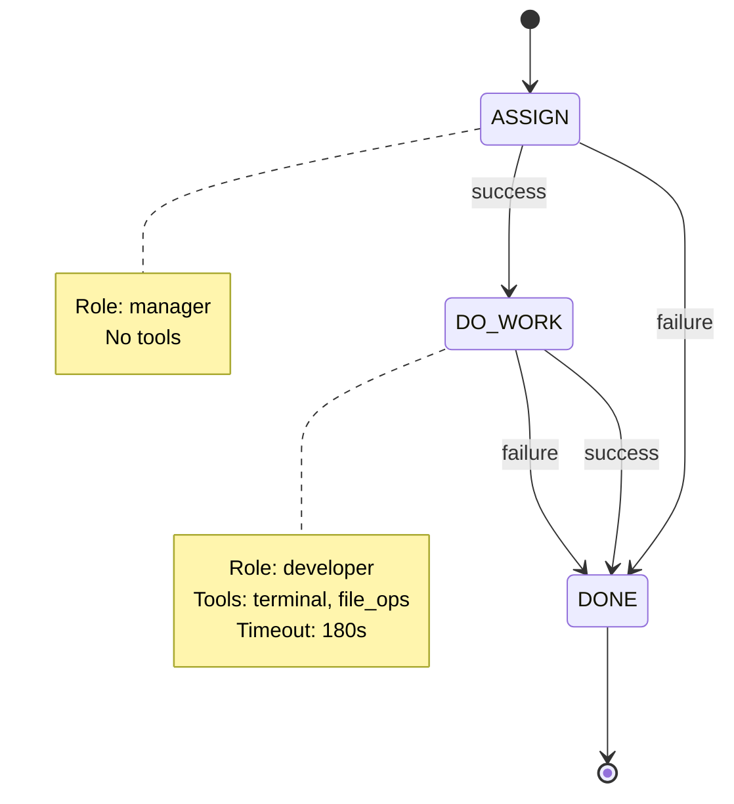

# Hello World: Your First Workflow in 30 Minutes

This tutorial teaches you **how workflows work** by creating one from scratch. You'll understand the structure, validate it, and learn where to go next for running complete examples.

## What You'll Learn

- Workflow JSON structure and required fields
- State definitions and transitions
- Role assignment and tool permissions
- How to validate your workflow
- Where the complexity actually lives (hint: it's in the messaging infrastructure)

**Reality check:** This tutorial focuses on workflow *authoring*. Actually *running* workflows requires additional test harness infrastructure. See `smoke_tests/` directory for complete runnable examples.

**Time:** 30 minutes  
**Outcome:** A valid workflow file you understand deeply

---

## Prerequisites

```bash
# 1. Verify Node.js installed (need 18+)
node --version

# 2. Verify you're in the project directory
pwd
# Should show: .../autonomous_copilot_agent

# 3. Install dependencies (if not already done)
npm install

# 4. Verify Copilot CLI authentication
# You're already authenticated if you can use Copilot CLI
```

---

## Step 1: Understanding Workflows (5 minutes)

A **workflow** is a JSON file that defines:
- **States**: Stages of work (like "implementing" or "testing")
- **Roles**: Who does each state (developer, qa, manager)
- **Transitions**: Where to go on success/failure
- **Prompts**: Instructions for the LLM at each state

Think of it like a flowchart:
```
START → ASSIGN → DO_WORK → DONE
```

If `DO_WORK` fails, it goes to `DONE` anyway (we'll keep it simple).

---

## Step 2: Create the Workflow File (10 minutes)

Create a new file: `workflows/hello-world.workflow.json`

```json
{
  "$schema": "./workflow.schema.json",
  "id": "hello-world",
  "name": "Hello World Workflow",
  "description": "A minimal workflow for learning. Manager assigns a simple task, developer completes it.",
  "version": "1.0.0",
  "initialState": "ASSIGN",
  "terminalStates": ["DONE"],
  "globalContext": {
    "projectPath": "workspace/project"
  },
  "states": {
    "ASSIGN": {
      "name": "Task Assignment",
      "role": "manager",
      "description": "Manager assigns a simple task to the developer.",
      "prompt": "You have a task to delegate.\n\nTask: {{taskDescription}}\n\nYour job:\n1. Acknowledge the task\n2. Report readiness to proceed\n\nSimply respond with: 'Task received: [task summary]. Ready to proceed.'\n\nDo NOT use any tools. Just respond with text.",
      "allowedTools": [],
      "requiredOutputs": [],
      "transitions": {
        "onSuccess": "DO_WORK",
        "onFailure": "DONE"
      }
    },

    "DO_WORK": {
      "name": "Implementation",
      "role": "developer",
      "description": "Developer completes the assigned task.",
      "prompt": "Complete this task: {{taskDescription}}\n\n**Procedure:**\n1. Navigate to the project directory: cd {{projectPath}}\n2. Create or modify files as needed\n3. Keep it simple - a single file is fine\n4. Report what you did\n\n**Example:** If the task is 'Create a hello world Python script', create `hello.py` with a print statement.\n\nAfter completing the work, describe what you created/changed.",
      "allowedTools": ["terminal", "file_ops"],
      "requiredOutputs": [],
      "transitions": {
        "onSuccess": "DONE",
        "onFailure": "DONE"
      },
      "maxRetries": 1,
      "timeoutMs": 180000
    },

    "DONE": {
      "name": "Complete",
      "role": "manager",
      "description": "Task is complete.",
      "prompt": "The task is complete. Review the work done.",
      "allowedTools": [],
      "transitions": {
        "onSuccess": null,
        "onFailure": null
      }
    }
  }
}
```

### Understanding Each Section

#### Top-Level Fields
```json
"id": "hello-world"              // Unique identifier (lowercase, hyphens)
"name": "Hello World Workflow"   // Human-readable name
"version": "1.0.0"               // Semantic version
"initialState": "ASSIGN"         // Where execution starts
"terminalStates": ["DONE"]       // States that end the workflow
```

#### Global Context
```json
"globalContext": {
  "projectPath": "workspace/project"  // Available to all prompts as {{projectPath}}
}
```

#### State Structure
Every state needs these fields:
- `name`: Display name
- `role`: Which agent handles this (manager, developer, qa)
- `description`: What happens in this state
- `prompt`: Instructions for the LLM
- `allowedTools`: What tools the agent can use
- `transitions`: Where to go next

**Note on Validation:** This framework deliberately does NOT build verification into the agent itself. Verification belongs in workflows (as a dedicated QA agent/state), not baked into every developer agent. See CRITICAL_ASSESSMENT.md for the design rationale - validation is a workflow concern, giving you flexibility for PoCs (skip validation), production (add QA states), or regulatory work (multi-stage verification). The agent stays lean and focused.

---

## Step 4: Validate Your Workflow (5 minutes)

### Automatic Validation (VS Code)

If using VS Code with JSON schema support, you'll get real-time validation.

### Command-Line Validation (Recommended)

Use the validation CLI for comprehensive checks:

```bash
# Validate your workflow
npx tsx scripts/validate-workflow.ts workflows/hello-world.workflow.json
```

Output if valid:
```
════════════════════════════════════════════════════════════════════════════════
📋 Hello World Workflow (hello-world)
📄 hello-world.workflow.json
════════════════════════════════════════════════════════════════════════════════
✅ Workflow is valid!
```

The validator checks:
- ✅ All required fields present
- ✅ Field types correct (strings, arrays, objects)
- ✅ State references valid (initialState, terminalStates, transitions)
- ✅ Terminal states configured correctly (null transitions)
- ✅ No unreachable states (orphaned from initialState)
- ⚠️ Warnings for potential issues (unreachable states, missing $schema)

### Validate Multiple Workflows

```bash
# Validate all workflows at once
npx tsx scripts/validate-workflow.ts workflows/*.workflow.json
```

### Common Validation Errors

The validator provides specific fixes for each error:

```bash
❌ 3 ERRORS

  1. Missing required field: "initialState"
     Field: initialState
     Fix: Add "initialState" at the top level of your workflow JSON

  2. State "DO_WORK" transition "onSuccess" references non-existent state "VALIDATE"
     Field: states.DO_WORK.transitions.onSuccess
     Fix: Available states: ASSIGN, DO_WORK, DONE

  3. Workflow "id" must be lowercase with hyphens only: "Hello_World"
     Field: id
     Fix: Example: "dev-qa-merge" not "Dev_QA_Merge"
```

---

## Step 5: Test Workflow Structure (5 minutes)

Before running with the agent, test the state machine logic:

```bash
# Test workflow structure
npx tsx scripts/test-workflow.ts workflows/hello-world.workflow.json \
  --task "Create hello world script"
```

Output:
```
════════════════════════════════════════════════════════════════════════════════
🧪 Workflow Test Runner
════════════════════════════════════════════════════════════════════════════════

📋 Loading workflow: workflows/hello-world.workflow.json
   Workflow: Hello World Workflow (hello-world)
   States: 3
   Initial: ASSIGN

▶️  Executing workflow...

  State 1: Task Assignment (ASSIGN)
    Role: manager
    Tools: none
    → Transition to: DO_WORK

  State 2: Implementation (DO_WORK)
    Role: developer
    Tools: terminal, file_ops
    → Transition to: DONE

  State 3: Complete (DONE)
    Role: manager
    Tools: none
    ✓ Terminal state reached

════════════════════════════════════════════════════════════════════════════════
✅ Workflow Test PASSED
════════════════════════════════════════════════════════════════════════════════

States visited: ASSIGN → DO_WORK → DONE
Total transitions: 3
```

This validates:
- States connect correctly
- No infinite loops
- Terminal state is reachable
- All transitions defined

**Important:** This tests the *state machine structure*, not actual LLM execution. For full execution, use the agent or smoke tests.

### Test Options

```bash
# Keep workspace to inspect files
npx tsx scripts/test-workflow.ts workflows/hello-world.workflow.json \
  --task "Create hello world" \
  --skip-cleanup

# Custom workspace location
npx tsx scripts/test-workflow.ts workflows/hello-world.workflow.json \
  --task "Create hello world" \
  --workspace ./my-test-workspace

# Add context variables
npx tsx scripts/test-workflow.ts workflows/hello-world.workflow.json \
  --task "Create hello world" \
  --context projectPath=custom/path \
  --context buildCommand="npm run build"

# Verbose logging
npx tsx scripts/test-workflow.ts workflows/hello-world.workflow.json \
  --task "Create hello world" \
  --verbose
```

---

## Step 6: Generate State Diagram (5 minutes)

Visualize your workflow to verify the state machine logic:

```bash# Generate Mermaid diagram
npx tsx scripts/workflow-to-mermaid.ts workflows/hello-world.workflow.json
```

Output:


**Copy the Mermaid code** and paste it into:
- GitHub markdown (renders automatically)
- VS Code (with Mermaid extension)
- [mermaid.live](https://mermaid.live) (online editor)

This visualization helps you verify:
- All states are reachable
- No dead ends (except terminal states)
- Transition logic makes sense
- Failure paths lead somewhere useful

---

## Step 7: Understanding What You Built

### Workflow Execution Flow

When a task enters this workflow:

1. **Engine loads workflow definition** from JSON
2. **Task starts in initialState** (`ASSIGN`)
3. **Engine finds agent** with role `manager`  
4. **Renders prompt** with context variable substitution
5. **Restricts tools** to those in `allowedTools`
6. **Agent executes** the state's work
7. **Engine evaluates result** (success/failure)
8. **Follows transition** to next state
9. **Repeats** until reaching a terminal state

### State Execution Details

For each state, the engine:

**Before execution:**
- Runs `onEntryCommands` (if defined)
- Builds the prompt with `{{variable}}` substitution
- Resolves tool groups (e.g., `terminal` → specific terminal tools)
- Sets tool restrictions

**During execution:**
- Sends prompt to LLM
- Monitors for timeout (`timeoutMs`)
- Collects outputs for `requiredOutputs`

**After execution:**
- Runs `onExitCommands` (if defined)
- Evaluates `exitEvaluation` question (if defined)
- Checks retries against `maxRetries`
- Adds transition record to task history
- Determines next state via `transitions`

### Why This Design?

**Separation of concerns:**
- **LLM decides HOW** - Creative problem solving within a state
- **State machine decides WHERE** - Deterministic routing between states
- **Tools control WHAT** - Capabilities available at each stage

**Benefits:**
- Predictable flow (not dependent on LLM whims)
- Easy debugging (which state are we in? where did we come from?)
- Auditability (transition history is recorded)
- Safety (tools gated per state)

---

## Step 8: Running Your Workflow (The Hard Part)

Now for the reality check: **actually running workflows requires infrastructure.**

### What's Required

1. **Workflow message format** - Structured MessageType: workflow with JSON payload (not simple markdown)
2. **Task state management** - Tracking context, history, retries
3. **Agent coordination** - Routing between roles if multi-agent
4. **Mailbox sync** - Git-based or local message passing
5. **Test harness** - Helper functions to create properly formatted messages

### The Easy Path: Use Smoke Tests

The `smoke_tests/` directory has complete working examples:

```bash
# Simplest example: basic workflow
cd smoke_tests/basic
./setup.sh
./run-test.sh

# Multi-agent coordination
cd smoke_tests/multi-agent
./setup.sh  
./run-test.sh

# Full regulatory workflow (V-model)
cd smoke_tests/regulatory
./setup.sh
./run-test.sh
```

Each smoke test includes:
- `setup.sh` - Creates agent directories, mailbox, git origin
- `run-test.sh` - Starts agents, sends workflow messages
- `validate.sh` - Checks expected artifacts were created
- `cleanup.sh` - Removes runtime artifacts

**Study these** to understand the full picture.

### Quick Test (Without Full Infrastructure)

If you just want to see workflow validation work:

```bash
# Load and validate the workflow
node -e "
const { WorkflowEngine } = require('./dist/workflow-engine.js');
const pino = require('pino');
const logger = pino({ level: 'info' });

async function test() {
  const engine = new WorkflowEngine(logger);
  try {
    await engine.loadWorkflowFromFile('workflows/hello-world.workflow.json');
    console.log('✓✓ Workflow loaded successfully!');
    console.log('States:', engine.getWorkflow('hello-world').states.map(s => s.name).join(', '));
  } catch (err) {
    console.error('✗ Workflow validation failed:', err.message);
  }
}
test();
"
```

This validates:
- JSON syntax
- Schema compliance
- State references
- Tool group resolution

---

## What You've Accomplished

You now understand:

✅ **Workflow JSON structure** - All required and optional fields  
✅ **State machine design** - States, transitions, terminal states  
✅ **Role-based execution** - How different agents handle different states  
✅ **Tool gating** - How `allowedTools` restricts capabilities  
✅ **Context variables** - Template substitution with `{{variable}}`  
✅ **Validation** - How to check if your workflow is correct  
✅ **Visualization** - Generating state diagrams

---

## What You Haven't Learned (Yet)

The workflow JSON you created is **complete and valid**, but running it requires:

❌ **Message formatting** - `MessageType: workflow` with structured JSON payload  
❌ **Task state management** - Creating `TaskState` objects with history  
❌ **Test harness** - Helper functions to send workflow messages  
❌ **Agent coordination** - If multi-agent, routing between roles  
❌ **Entry/exit commands** - Git operations for code handoff  

**These are covered in the smoke tests.**

---
  

---

## Common Issues & Fixes

### Issue: "Cannot find module './dist/workflow-engine.js'"
**Cause:** Project not compiled  
**Fix:** Run `npm run build` to compile TypeScript to JavaScript

### Issue: JSON syntax error when validating
**Cause:** Trailing comma, missing comma, or unmatched braces  
**Fix:** Use VS Code's JSON validation or paste into [jsonlint.com](https://jsonlint.com)

### Issue: "State 'DO_WORK' not found"
**Cause:** Typo in state name or transition reference  
**Fix:** State names are case-sensitive, check all references

### Issue: "initialState must reference a state in 'states'"
**Cause:** `initialState: "ASSIGN"` but no state with key `"ASSIGN"`  
**Fix:** Ensure state keys match exactly (not the `name` field, the JSON key)

### Issue: Mermaid diagram generation fails
**Cause:** Script expects compiled JavaScript  
**Fix:** Run `npm run build` first, then try again

---

## Next Steps: From Hello World to Production

### 1. Study Real Workflows

Compare your hello-world to production workflows:

```bash
# Open these side-by-side in your editor
code workflows/hello-world.workflow.json
code workflows/dev-qa-merge.workflow.json
code workflows/regulatory.workflow.json
```

**Look for:**
- How they use `onEntryCommands` / `onExitCommands` for git operations
- How `exitEvaluation` gates transitions (pass/fail checks)
- How `requiredOutputs` ensures necessary context is captured
- How retry logic (`maxRetries`) handles intermittent failures
- How timeouts (`timeoutMs`) prevent infinite hangs

### 2. Run the Smoke Tests

Experience workflows in action:

```bash
# Basic workflow - simplest example
cd smoke_tests/basic
./setup.sh && ./run-test.sh

# Multi-agent - dev/QA coordination
cd../multi-agent
./setup.sh && ./run-test.sh

# Regulatory - full V-model
cd ../regulatory
./setup.sh && ./run-test.sh
```

**Watch for:**
- How agents coordinate via mailbox
- How state transitions happen automatically
- How git operations flow artifacts between agents
- How failures trigger rework loops

### 3. Add Verification to Your Workflow

Enhance hello-world with a validation state:

```json
"DO_WORK": {
  "transitions": {
    "onSuccess": "VALIDATE",  // Changed from DONE
    "onFailure": "DONE"
  }
},

"VALIDATE": {
  "name": "Validation",
  "role": "qa",
  "description": "Verify the hello.py script works",
  "prompt": "Test the hello.py script.\n\n1. Run: python3 {{projectPath}}/hello.py\n2. Verify output is exactly 'Hello, World!'\n3. Check file has a comment\n\nReport PASS or FAIL.",
  "allowedTools": ["terminal"],
  "requiredOutputs": [],
  "exitEvaluation": {
    "question": "Did all validations pass?",
    "mapping": {
      "true": "success",
      "false": "failure"
    }
  },
  "transitions": {
    "onSuccess": "DONE",
    "onFailure": "REWORK"
  },
  "maxRetries": 1,
  "timeoutMs": 60000
},

"REWORK": {
  "name": "Fix Issues",
  "role": "developer",
  "description": "Fix validation failures",
  "prompt": "Fix the issues found:\n\n{{validationErrors}}\n\nUpdate {{projectPath}}/hello.py and report changes.",
  "allowedTools": ["terminal", "file_ops"],
  "transitions": {
    "onSuccess": "VALIDATE",
    "onFailure": "DONE"
  },
  "maxRetries": 2,
  "timeoutMs": 180000
}
```

This creates a QA feedback loop: DO_WORK → VALIDATE → (pass: DONE, fail: REWORK → VALIDATE)

### 4. Add Git Operations

Real workflows commit code at each state:

```json
"DO_WORK": {
  "onEntryCommands": [
    "cd {{projectPath}}",
    "git fetch origin",
    "git checkout -b task-{{taskId}}"
  ],
  "onExitCommands": [
    "cd {{projectPath}}",
    "git add -A",
    "git commit -m 'Implemented: {{taskDescription}}'",
    "git push origin task-{{taskId}}"
  ]
}
```

This ensures all work is versioned and recoverable.

### 5. Learn the Test Harness

For automated testing:

```bash
# Study the smoke test CLI tool
cat scripts/smoke-test-cli.ts

# See how to create workflow messages programmatically
grep -A 20 "createWorkflowMessage" scripts/smoke-test-cli.ts
```

Key functions:
- `createWorkflowMessage()` - Creates proper MessageType: workflow messages
- `checkDelivery()` - Verifies message was delivered
- `checkLogEvent()` - Waits for specific log entries
- `waitForCompletion()` - Blocks until task reaches terminal state

---

## Reference

### Workflow Development Tools

The framework provides CLI tools for workflow development:

**Config Validation:**
```bash
# Validate config.json
npx tsx scripts/validate-config.ts

# Validate custom config
npx tsx scripts/validate-config.ts path/to/custom-config.json
```

Checks: required sections, field types, enums, file path references, interval ranges, permission policies

**Workflow Validation:**
```bash
# Validate single workflow
npx tsx scripts/validate-workflow.ts workflows/my-workflow.workflow.json

# Validate all workflows
npx tsx scripts/validate-workflow.ts workflows/*.workflow.json
```

Checks: required fields, state references, terminal states, unreachable states, type validation

**Structure Testing:**
```bash
# Test workflow state machine
npx tsx scripts/test-workflow.ts workflows/my-workflow.workflow.json \
  --task "Task description"

# With options
npx tsx scripts/test-workflow.ts workflows/my-workflow.workflow.json \
  --task "Task description" \
  --workspace ./test-ws \
  --context key=value \
  --skip-cleanup \
  --verbose
```

Tests: state connectivity, transition logic, no infinite loops, terminal state reachability

**Visualization:**
```bash
# Generate state diagram
npx tsx scripts/workflow-to-mermaid.ts workflows/my-workflow.workflow.json

# All workflows
npm run workflow:diagram
```

Outputs: Mermaid state diagram for visual validation

### Minimal Workflow Template

Copy-paste starting point:

```json
{
  "$schema": "./workflow.schema.json",
  "id": "my-workflow",
  "name": "My Workflow",
  "description": "What this does",
  "version": "1.0.0",
  "initialState": "START",
  "terminalStates": ["DONE"],
  "globalContext": {
    "projectPath": "workspace/project"
  },
  "states": {
    "START": {
      "name": "Start",
      "role": "developer",
      "description": "Entry point",
      "prompt": "Do the thing: {{taskPrompt}}",
      "allowedTools": ["terminal", "file_ops"],
      "requiredOutputs": [],
      "transitions": {
        "onSuccess": "DONE",
        "onFailure": "DONE"
      },
      "maxRetries": 2,
      "timeoutMs": 300000
    },
    "DONE": {
      "name": "Complete",
      "role": "manager",
      "description": "Terminal state",
      "prompt": "",
      "allowedTools": [],
      "transitions": {
        "onSuccess": null,
        "onFailure": null
      }
    }
  }
}
```

### Required Fields Checklist

**Top-level:**
- [ ] `$schema` (for editor support)
- [ ] `id` (lowercase, hyphens, unique)
- [ ] `name` (human-readable)
- [ ] `description` (what it does)
- [ ] `version` (semver: 1.0.0)
- [ ] `initialState` (must exist in states)
- [ ] `terminalStates` (array, must exist in states)
- [ ] `globalContext` (object, can be empty)
- [ ] `states` (object, min 2 states)

**Per state:**
- [ ] `name` (display name)
- [ ] `role` (which agent)
- [ ] `description` (what happens here)
- [ ] `prompt` (LLM instructions)
- [ ] `allowedTools` (array, can be empty)
- [ ] `transitions` (onSuccess + onFailure)

**Terminal states:**
- [ ] `transitions.onSuccess: null`
- [ ] `transitions.onFailure: null`

---

## Further Reading

- **Schema Reference**: [workflows/workflow.schema.json](workflows/workflow.schema.json) - Complete field documentation
- **Main README**: [README.md](README.md) - Full framework capabilities
- **Workflow Construction Guide**: [README.md#workflow-construction-guide](README.md#workflow-construction-guide) - Design patterns
- **Smoke Test README**: [smoke_tests/README.md](smoke_tests/README.md) - Running complete examples
- **Critical Assessment**: [CRITICAL_ASSESSMENT.md](CRITICAL_ASSESSMENT.md) - Honest limitations
- **Roles Documentation**: [ROLES.md](ROLES.md) - Agent role definitions

---

## Success!

You've created a valid workflow and understand how the state machine operates. 🎉

**What you can do now:**
- Author new workflows confidently
- Understand production workflow examples
- Validate workflow structure before testing
- Visualize state machines
- Know where to look for running examples (smoke tests)

**The gap:** Running workflows requires test infrastructure (mailbox, message formatting, state management). The smoke tests bridge this gap with complete working examples.

**Next:** Pick a smoke test, run it, study its setup. That's the complete picture.
