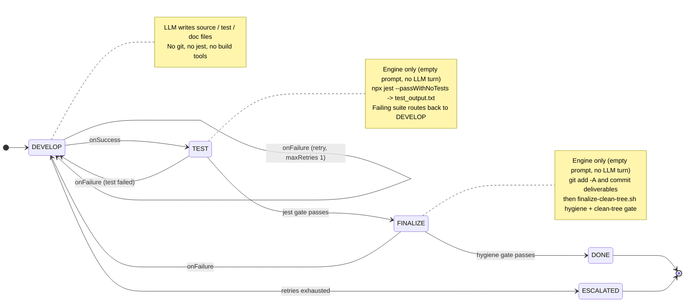

# converter-workflow smoke test

A deterministic, **workflow-driven** smoke test that builds a small TypeScript
unit converter module. It is the engine-driven counterpart to
[`converter-ad-hoc`](../converter-ad-hoc/README.md) and is designed for **A/B
comparison**: both tests produce the *same* artifact, but this one removes the
LLM from every process decision.

## The A/B comparison

| Aspect | `converter-ad-hoc` | `converter-workflow` (this test) |
| --- | --- | --- |
| Driver | LLM decides the steps | Workflow state machine decides the steps |
| Git commits | LLM runs `git` | Engine runs `git` via `onExitCommands` |
| Jest runs | LLM runs `jest` | Engine runs `jest` via `onExitCommands` (gates the `TEST` transition) |
| LLM responsibility | Everything | **Only writes `converter.ts` / `converter.test.ts` / `README.md`** |
| Determinism | Low (LLM-driven) | High (engine-driven) |
| Goal artifact | Identical | Identical |

Both tests are graded by the same LLM-as-Judge against the **same task
specification** (`judge-instructions.md`, whose Expected Deliverables section is
identical between the two tests), so their scores are directly comparable.

## What it builds

A `converter.ts` module exporting four functions plus a `converter.test.ts`
suite (11+ assertions), captured Jest output in `test_output.txt`, and a
documented `README.md`. The engine commits each assignment's deliverables once,
at its `FINALIZE` state.

## The workflow

`workflow.json` defines a generic, deliverable-agnostic single-developer state
machine (`DEVELOP -> TEST -> FINALIZE -> DONE`). Every state has
`role: developer`, so a rework transition routes back to the same agent (this
requires a non-empty `teamMembers` roster, configured in
`agent/config.template.json`). The same three-state process drives every
assignment; the WHAT comes from each assignment's `taskPrompt`, not from the
workflow. The three deliverables (build the module, add `kilogramsToPounds`,
write the `README`) are three separate assignments (`converter-01/02/03`),
seeded serially, each run through the full machine.

```text
DEVELOP ─▶ TEST ─▶ FINALIZE ─▶ DONE
```

### State diagram

The diagram shows the three-state `onSuccess` path plus the `onFailure` routes.
`DEVELOP` self-loops to retry (bounded by `maxRetries: 1`) and escalates when
that budget is exhausted; the engine-only `TEST` and `FINALIZE` gates route back
to `DEVELOP` for rework on failure. A forward transition fires only after that
state's `onExitCommands` gates pass.



| State | LLM writes | Engine does on exit (deterministic) |
| --- | --- | --- |
| `DEVELOP` | the source, test, and/or doc files the assignment requires | log only (no git, no jest, no build tools) |
| `TEST` | none (empty prompt) | `npx jest --passWithNoTests` gate, captures `test_output.txt`; a failing suite routes back to `DEVELOP` |
| `FINALIZE` | none (empty prompt) | `git add -A` and commit deliverables, then `finalize-clean-tree.sh` (clean untracked noise, commit leftovers, gate on a clean tree) |
| `DONE` | none | terminal |
| `ESCALATED` | none | terminal (reached when `DEVELOP` exhausts its retry budget) |

The `DEVELOP` prompt explicitly tells the LLM **not** to run git or jest; the
engine owns those steps. Each `onExitCommands` entry with `failOnError: true`
gates the transition: if a test fails or the working tree is not clean, the
workflow does not advance and routes back to `DEVELOP` for rework.

## How to run

```bash
./run-test.sh
```

This will:

1. `setup.sh` — copy the agent source, seed a Jest + TypeScript project skeleton
   into `agent/workspace/project`, `git init`, `npm ci`, and seed the first
   `WorkflowAssignment` (`converter-01`) at the `DEVELOP` state. `run-test.sh`
   seeds `converter-02` and `converter-03` serially as each prior assignment
   reaches a terminal state.
2. Compile the agent (`tsc`) and start it.
3. Monitor the log until the workflow reaches its terminal state.
4. Run `validate.sh` (deterministic checks).
5. Run the LLM judge against `judge-instructions.md` (non-blocking).

## Validation

`validate.sh` mirrors the converter-ad-hoc checks (same goal output) and adds
workflow-specific assertions:

- Workflow engine loaded
- ≥4 state transitions fired
- Terminal state (`DONE`) reached
- `test_output.txt` shows a clean passing Jest run
- ≥4 commits (1 setup + 3 assignment finalize commits), clean working tree

## Files

| File | Purpose |
| --- | --- |
| `workflow.json` | The deterministic state machine |
| `agent/config.template.json` | Agent config (workflow file + `teamMembers` roster) |
| `scripts/finalize-clean-tree.sh` | Deterministic hygiene finalize called from `FINALIZE` (copied to `agent/workspace/` by `setup.sh`) |
| `setup.sh` | Provisions the agent, project skeleton, and seed message |
| `run-test.sh` | Orchestrates setup → run → validate → judge |
| `validate.sh` | Deterministic pass/fail checks |
| `judge-instructions.md` | Shared task spec used by the LLM judge |
