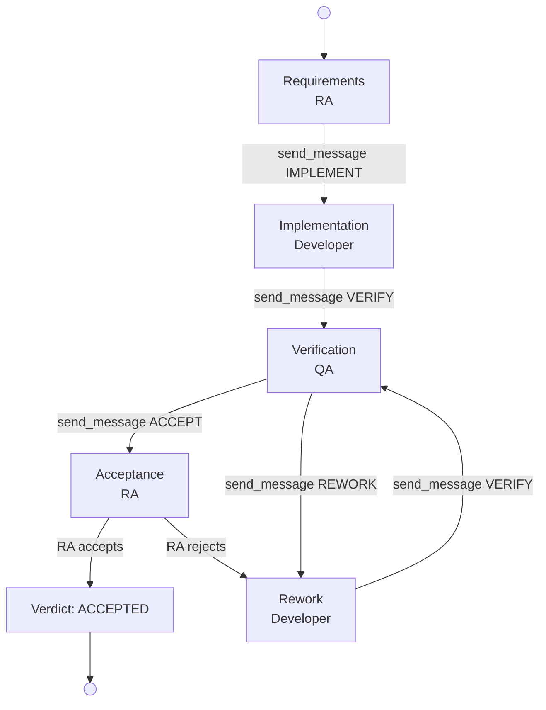

# V-Model Regulatory Evidence Smoke Test (Ad-Hoc / LLM-Driven Arm)

Ad-hoc arm of the regulatory determinism comparison. There is NO workflow
engine. The LLM agents drive the entire V-model themselves. They run all git
commands, run the tests, gate their own work, sequence the phases, and hand
off to each other by calling send_message(). This is the LLM-driven arm that
pairs with regulatory-workflow, where the same work is engine-driven instead.

The two arms share the same three requirements, the same deterministic
validate.sh gate, and the same judge, so the only variable is who drives the
process. The engine in the workflow arm, or the LLMs in this arm.

3-agent smoke test demonstrating a V-model regulatory evidence pipeline
under HIPAA Security Rule (45 CFR 164). The Requirements Analyst (RA)
defines requirements at the top-left of the V and accepts the final delivery
at the top-right, closing the loop.

## V-Model Flow (LLM-Driven Handoffs)



Each arrow is a plain mailbox message the sending agent composes and delivers
via send_message(). No engine advances the cycle. If an agent does not send a
message, no one downstream does any work.

### Expected Evidence Artifacts

| Phase | Role | Artifacts |
|-------|------|-----------|
| Requirements | RA | `docs/requirements-specification.md`, `docs/acceptance-criteria-checklist.md` |
| Implementation | Developer | `src/*.ts`, `tests/*.test.ts`, `evidence/developer-traceability.md` |
| Verification | QA | `evidence/traceability-matrix.md`, `evidence/verification-report.md`, `tests/integration/*.test.ts` |
| Acceptance | RA | `evidence/acceptance-verdict.md` |

## Agents

| Agent | Hostname | Role | V-Model Position | Handoff |
|-------|----------|------|------------------|---------|
| Requirements Analyst | smoke-regah-ra | requirements-analyst | Left top / Right top | Opens with requirements, closes with acceptance verdict |
| Developer | smoke-regah-dev | developer | Bottom | Implements, tests, hands to QA |
| QA | smoke-regah-qa | qa | Right ascending | Verifies, merges, hands back to RA |

A manager config exists in the directory but is not started. Only the RA,
Developer, and QA agents run. All handoffs are peer to peer via send_message()
using the teamMembers roster, with no manager and no workflow engine in the loop.

### Role Architecture

The RA runs with `role: requirements-analyst` (`isDelegator: false` in roles.json),
which means it executes work directly in its own workspace rather than delegating.
This role was added specifically to avoid the `isDelegator` trap where a
manager-role agent delegates work instead of doing it. In this arm the RA also
acts as the human-free orchestrator of the cycle, seeding each requirement and
recording the final verdict.

## Requirements

| ID | Description | HIPAA Reference |
|----|-------------|-----------------|
| REQ-HCDP-001 | Bare CLI `hcdp-validate` that runs via `npx ts-node src/cli.ts` and exits 0 with no arguments | 164.312(c)(1) (Data integrity controls) |
| REQ-HCDP-002 | JSONL record validation: each record `recordType` is one of patient, procedure, or diagnosis | 164.312(b) (Audit controls) |
| REQ-HCDP-003 | Referential integrity: every procedure and diagnosis `patientId` matches a patient record id | General (Traceability) |

## Evidence Artifacts by Agent

### RA (Requirements Analyst)
- `docs/requirements-specification.md` -- formal requirements with acceptance criteria
- `docs/acceptance-criteria-checklist.md` -- machine-readable checklist
- `evidence/acceptance-verdict.md` -- final accept/reject decision (closing the V)

### Developer
- `src/*.ts` -- CLI and validation modules implementing REQ-HCDP-001 through 003
- `tests/*.test.ts` -- unit tests referencing each REQ-HCDP-XXX
- `evidence/developer-traceability.md` -- REQ -> source -> test mapping

### QA
- `evidence/traceability-matrix.md` -- cross-requirement traceability matrix
- `evidence/verification-report.md` -- verification checklist and QA verdict
- `tests/integration/*.test.ts` -- integration tests referencing the REQ IDs

## Running

```bash
# Full automated run (setup + run + validate)
./run-test.sh

# Or step by step:
./setup.sh        # Create 3 agent environments + seed the RA mailbox
./run-test.sh     # Compile, start agents, monitor verdicts, validate
./validate.sh     # Run validation checks independently
```

## Validation Checks

The validate.sh script checks:

1. **RA workspace** -- requirements spec, acceptance checklist, all 3 REQ IDs present
2. **Developer workspace** -- source files, test files with REQ references, evidence document
3. **QA workspace** -- traceability matrix, verification report, integration tests with REQ cross-references
4. **Cross-agent traceability** -- each REQ ID appears in at least 2 agent workspaces
5. **Agent activity** -- RA, Developer, QA logs show handoff and work activity

The RA acceptance verdict is the primary test gate. The V-model succeeds when the RA
examines the QA verification report and traceability matrix and issues an ACCEPTED verdict
in `evidence/acceptance-verdict.md`.

## Design Notes

- There is no `workflowFile` and no `workflow.json`. Removing them is the whole point
  of this arm. The LLM agents must self-organize the V-model handoffs.
- The RA seeds each requirement as a plain mailbox message and runs every git command
  itself. The Developer and QA likewise run their own git and test commands.
- Handoffs are peer to peer via send_message(). The per-role protocol lives in each
  agent's `custom_instructions.json` under the Ad-Hoc V-Model Protocol section.
- run-test.sh seeds REQ-HCDP-001 through 003 serially, waiting for the RA to record a
  verdict for each before seeding the next. This mirrors the serial structure of the
  workflow arm so the two are directly comparable.
- This arm is the harder path. Weaker models often botch the self-organized handoffs,
  and that difficulty is itself the finding the comparison is designed to surface.
