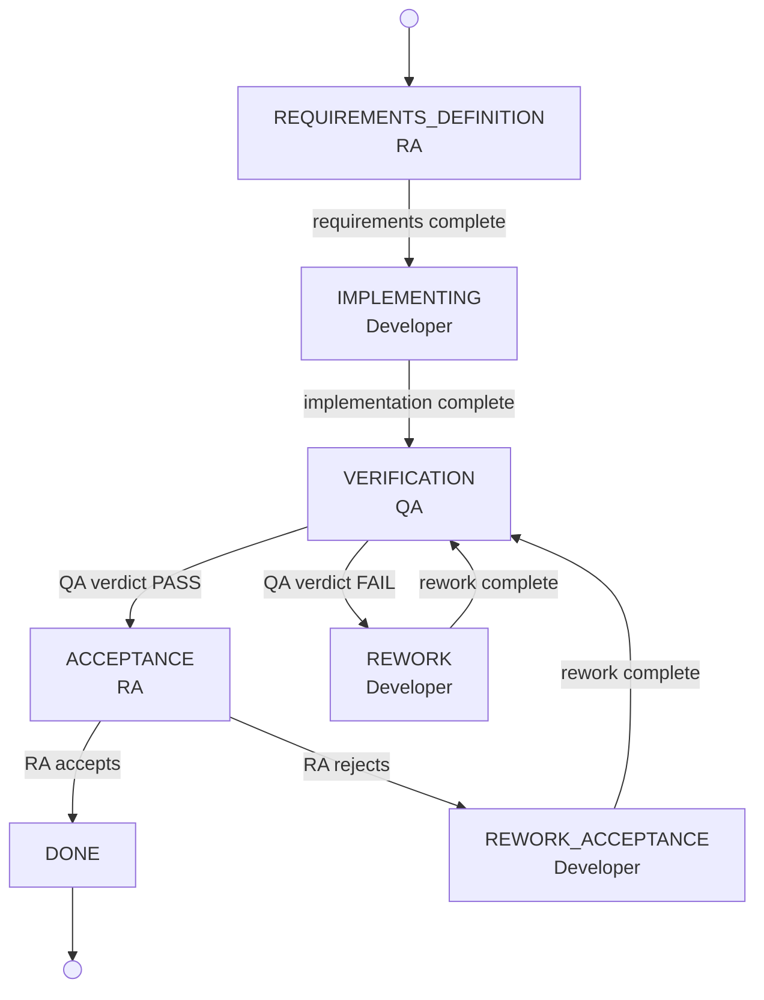

# V-Model Regulatory Evidence Smoke Test

4-agent smoke test demonstrating a V-model regulatory evidence pipeline
under HIPAA Security Rule (45 CFR 164). A Manager agent orchestrates by
delegating the initial workflow assignment, the Requirements Analyst (RA)
defines requirements at the top-left of the V and accepts the final delivery
at the top-right, closing the loop.

## V-Model State Diagram



### Expected Evidence Artifacts

| State | Role | Artifacts |
|-------|------|-----------|
| REQUIREMENTS_DEFINITION | RA | `docs/requirements-specification.md`, `docs/acceptance-criteria-checklist.md` |
| IMPLEMENTING | Developer | `src/*.ts` (REQ annotations), `tests/*.test.ts`, `evidence/developer-traceability.md` |
| VERIFICATION | QA | `evidence/traceability-matrix.md`, `evidence/verification-report.md`, `tests/integration/*.test.ts` |
| ACCEPTANCE | RA | `evidence/acceptance-verdict.md` |

## Agents

| Agent | Hostname | Role | V-Model Position | Workflow State |
|-------|----------|------|------------------|----------------|
| Manager | smoke-reg-mgr | manager | Orchestrator (delegation) | None (no workflowFile) |
| Requirements Analyst | smoke-reg-ra | requirements-analyst | Left top / Right top | REQUIREMENTS_DEFINITION, ACCEPTANCE |
| Developer | smoke-reg-dev | developer | Bottom | IMPLEMENTING, REWORK, REWORK_ACCEPTANCE |
| QA | smoke-reg-qa | qa | Right ascending | VERIFICATION |

### Role Architecture

The Manager runs with `role: manager` (`isDelegator: true` in roles.json), so its
prompt template is entirely delegation-focused -- it breaks down work and sends
messages to other agents. It does NOT execute workflow states directly.

The RA runs with `role: requirements-analyst` (`isDelegator: false` in roles.json),
which means it executes work directly in its own workspace. This role was added
specifically to avoid the `isDelegator` trap where a manager-role agent delegates
work instead of doing it.

## Requirements

| ID | Description | HIPAA Reference |
|----|-------------|-----------------|
| REQ-HCDP-001 | Input data validation for patient record data | 164.312(c)(1) (Data integrity controls) |
| REQ-HCDP-002 | Deterministic error handling with structured records | 164.312(b) (Audit controls) |
| REQ-HCDP-003 | Requirement traceability across all artifacts | General (Traceability) |

## Evidence Artifacts by Agent

### RA (Requirements Analyst)
- `docs/requirements-specification.md` -- formal requirements with acceptance criteria
- `docs/acceptance-criteria-checklist.md` -- machine-readable checklist
- `evidence/acceptance-verdict.md` -- final accept/reject decision (closing the V)

### Developer
- `src/data-validator.ts` -- REQ-HCDP-001 implementation
- `src/error-handler.ts` -- REQ-HCDP-002 implementation
- `src/index.ts` -- REQ-HCDP-003 module entry
- `tests/data-validator.test.ts` -- REQ-HCDP-001 unit tests
- `tests/error-handler.test.ts` -- REQ-HCDP-002 unit tests
- `evidence/developer-traceability.md` -- REQ -> source -> test mapping

### QA
- `evidence/traceability-matrix.md` -- cross-requirement traceability matrix
- `evidence/verification-report.md` -- verification checklist and QA verdict
- `evidence/requirement-coverage.md` -- file-level requirement coverage
- `tests/integration/validation-error-flow.test.ts` -- REQ-HCDP-001 + REQ-HCDP-002 integration
- `tests/integration/traceability-check.test.ts` -- REQ-HCDP-003 programmatic verification

## Running

```bash
# Full automated run (setup + run + validate)
./run-test.sh

# Or step by step:
./setup.sh        # Create 4 agent environments + seed mailbox
./run-test.sh     # Compile, start agents, monitor, validate
./validate.sh     # Run validation checks independently
```

## Validation Checks

The validate.sh script checks:

1. **Manager log** -- log file present, delegation activity detected
2. **RA workspace** -- requirements spec, acceptance checklist, all 3 REQ IDs present
3. **Developer workspace** -- source files with REQ annotations, test files with REQ references, evidence document
4. **QA workspace** -- traceability matrix, verification report, integration tests with REQ cross-references
5. **Cross-agent traceability** -- each REQ ID appears in at least 2 agent workspaces
6. **Workflow engine logs** -- RA, Developer, QA all show workflow activity

The RA acceptance verdict is the primary test gate. The V-model succeeds when the RA
examines the QA verification report and traceability matrix and issues an ACCEPTED verdict.

## Design Notes

- The Manager uses `role: manager` which activates `isDelegator: true` in prompt-templates.ts.
  Its prompt is entirely delegation-focused: break down work and send messages to other agents.
  It does NOT have a `workflowFile` and does NOT execute workflow states.
- The RA uses a dedicated `requirements-analyst` role (`isDelegator: false`), ensuring it
  executes requirements work directly in its workspace rather than trying to delegate.
- All 4 agents run in parallel with pre-seeded workflow messages. In a production V-model,
  the states would execute sequentially with mailbox-driven transitions.
- QA produces both evidence documents AND integration tests, strengthening the chain from
  paper traceability to executable verification.
- Target runtime: ~15-30 minutes typical (60 minute timeout in run-test.sh).
