# Workflows

Workflow definitions are data-driven state machines stored as `.workflow.json` files. Each file defines a directed graph of states with role assignments, prompt templates, tool permissions, and transition rules.

## Schema

All workflow files are validated against [`workflow.schema.json`](workflow.schema.json). Add this to the top of any new workflow file for editor support (autocomplete, inline validation):

```json
{
  "$schema": "./workflow.schema.json",
  ...
}
```

## Files

| File | Description |
|------|-------------|
| `workflow.schema.json` | JSON Schema for workflow definitions |
| `hello-world.workflow.json` | Minimal learning workflow (manager assigns, developer completes) |
| `dev-qa-merge.workflow.json` | Standard dev/QA/merge pipeline (project default) |
| `regulatory.workflow.json` | Linear regulated pipeline with static analysis, coverage, code review, traceability |
| `v-model-regulatory.workflow.json` | V-model regulated pipeline (requirements through acceptance testing) |

### dev-qa-merge State Diagram

The dev-qa-merge workflow is the default project workflow. The diagram below
shows the state machine: Manager assigns, Developer implements on a feature
branch, QA validates (with a rework loop if needed), and a mechanical merge
lands the code on main.



## Exit Evaluation

States can define an `exitEvaluation` field to replace regex-based fail
detection with a structured LLM question. After work items complete, the
engine sends a constrained prompt (e.g., "Did all tests pass? true/false")
and maps the parsed response to `success` or `failure` for transition routing.

See the main [README](../README.md#exit-evaluation-exitevaluation) for full
documentation and examples. The schema is defined in
[`workflow.schema.json`](workflow.schema.json) under `$defs/ExitEvaluation`.

## Mechanization Design Principle

LLMs are unreliable at deterministic tasks. When an LLM is asked to run
`git add`, `git commit`, `git push`, or execute build/test/lint commands,
it can forget a step, get the command wrong, or misreport the result. These
are not tasks that require judgment -- they are mechanical operations with
known-correct sequences. Every time we ask the LLM to do one of these, we
introduce an unnecessary opportunity for failure.

The shipped workflows apply a consistent principle: **move every
deterministic operation out of the prompt and into mechanical entry/exit
commands.** The LLM should spend its token budget only on work that
requires intelligence -- writing code, analyzing requirements, reviewing
quality. Everything else should be a deterministic command sequence that
runs regardless of what the LLM does or forgets.

### Patterns Applied

All shipped workflow files use these four patterns:

| Pattern | What It Replaces | Why |
|---------|-----------------|-----|
| `onEntryCommands` | Git fetch/checkout/reset in prompts | Guarantees the working tree is in the correct state before the LLM begins. The LLM cannot forget to sync. |
| `onExitCommands` | Git add/commit/push in prompts, build/test/lint in prompts | Guarantees work is committed and pushed after the LLM finishes. Quality gates (`failOnError: true`) block the transition if build/test/lint fail. The LLM cannot skip or misreport these. |
| `exitEvaluation` | Regex-based pass/fail detection of LLM output | Asks a direct yes/no question instead of parsing unstructured text. Eliminates false positives from verdict tables that mention both "PASS" and "FAIL". |
| `captureAs` on `onEntryCommands` | LLM manually recording SHAs in output | Records the exact commit SHA being verified, mechanically and reliably, for downstream traceability. |

### What This Means for Workflow Authors

When writing or adapting a workflow:

1. **Never put git state-management commands in the prompt.** Use
   `onEntryCommands` for checkout/sync and `onExitCommands` for
   add/commit/push. The prompt should say "You are ALREADY on branch X"
   and "Do NOT run git commands."

2. **Never rely on the LLM to run build/test/lint.** Add them as
   `onExitCommands` with `failOnError: true`. The prompt can mention
   them as context ("quality gates run automatically") but should not
   ask the LLM to execute them.

3. **Use `exitEvaluation` for every non-trivial transition decision.**
   Ask a direct boolean question. Do not parse the LLM's free-text output
   for keywords.

4. **Use `captureAs` to record SHAs.** Any command like
   `git rev-parse HEAD` that produces a value needed downstream should
   use `captureAs` to store it reliably.

5. **Make merge states fully mechanical.** If the only operations are
   git merge, push, and branch cleanup, use empty `prompt` and empty
   `allowedTools`. The entry/exit commands do all the work.

## Customizing for Your Language

The shipped workflow files default to **Rust** (`cargo build`, `cargo test`,
`cargo clippy`). Before using any workflow, update the `globalContext` fields
`buildCommand`, `testCommand`, and `lintCommand` to match your project's
toolchain.

### Required Fields

| Field | Purpose | Examples |
|-------|---------|----------|
| `buildCommand` | Compile / build the project | `cargo build`, `npm run build`, `go build ./...`, `dotnet build` |
| `testCommand` | Run the test suite | `cargo test`, `npm test`, `pytest`, `go test ./...`, `dotnet test` |
| `lintCommand` | Run the linter | `cargo clippy -- -D warnings`, `npm run lint`, `ruff check .`, `golangci-lint run` |

These values are substituted into prompt templates and `onExitCommands` via
`{{buildCommand}}`, `{{testCommand}}`, and `{{lintCommand}}`. If they are
wrong for your language, every mechanical quality gate in the workflow will
fail.

### Example: Changing to TypeScript / Node.js

```json
"globalContext": {
  "projectPath": "workspace/project",
  "buildCommand": "npm run build",
  "testCommand": "npm test",
  "lintCommand": "npm run lint"
}
```

### Example: Changing to Python

```json
"globalContext": {
  "projectPath": "workspace/project",
  "buildCommand": "python -m py_compile $(find . -name '*.py')",
  "testCommand": "pytest",
  "lintCommand": "ruff check ."
}
```

### Language-Specific Prompt Content

Some workflow prompts contain language-specific guidance beyond the three
command fields. For example, the `VALIDATING` prompt in
`dev-qa-merge.workflow.json` references `cargo fmt --check`, `///` doc
comments, `//!` module comments, and `Display/Error` trait implementations.
When adapting a workflow to a different language, review every state's
`prompt` field and replace language-specific references with equivalents
for your toolchain.

## Development Tools

### Config Validation

Validate your `config.json` before running the agent:

```bash
# Validate default config.json
npx tsx scripts/validate-config.ts

# Validate custom config
npx tsx scripts/validate-config.ts path/to/custom-config.json
```

Checks:
- Required sections (agent, mailbox, copilot, workspace, logging, manager)
- Field types match TypeScript interfaces
- Enum values (role, validation mode, log level, priority, permissions)
- Numeric ranges (intervals, timeouts)
- File path references exist (roles file, workflow file, mailbox path)
- Permission policies are valid

### Workflow Validation

Validate workflow JSON files before using them:

```bash
# Validate single workflow
npx tsx scripts/validate-workflow.ts workflows/my-workflow.workflow.json

# Validate all workflows
npx tsx scripts/validate-workflow.ts workflows/*.workflow.json
```

Checks:
- Required fields (id, name, description, roles, initialState, states, terminalStates)
- State references (initialState, terminalStates, transitions point to existing states)
- Unreachable states detection
- Tool group resolution
- Type validation

### Workflow Structure Testing

Test workflow state machine logic without full infrastructure:

```bash
# Basic test
npx tsx scripts/test-workflow.ts workflows/my-workflow.workflow.json --task "Task description"

# With options
npx tsx scripts/test-workflow.ts workflows/my-workflow.workflow.json \
  --task "Task description" \
  --workspace ./test-ws \
  --context key=value \
  --skip-cleanup \
  --verbose
```

Tests:
- State connectivity
- Transition paths
- No infinite loops
- Terminal state reachability

**Note:** This is a structural test only - it doesn't execute LLM completions.

### Generating State Diagrams

Generate Mermaid state diagrams from workflow files to visually validate them.

**All workflows:**

```bash
cd autonomous_copilot_agent
npm run workflow:diagram
```

**Specific file:**

```bash
npx tsx scripts/workflow-to-mermaid.ts workflows/dev-qa-merge.workflow.json
```

**Save to file:**

```bash
npm run workflow:diagram > workflows/STATE_DIAGRAMS.md
```

Output includes a state table, role legend, and a Mermaid `stateDiagram-v2` block for each workflow. Paste the Mermaid blocks into any Mermaid renderer (GitHub markdown, VS Code preview, mermaid.live) to view the diagrams.
