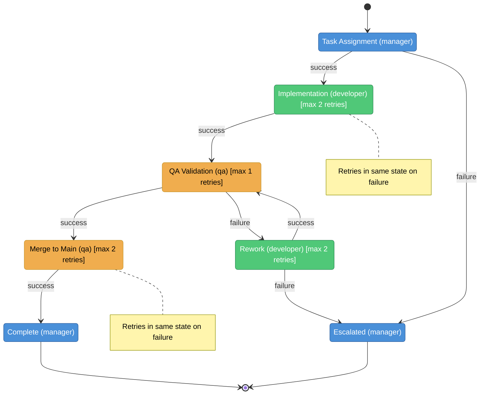
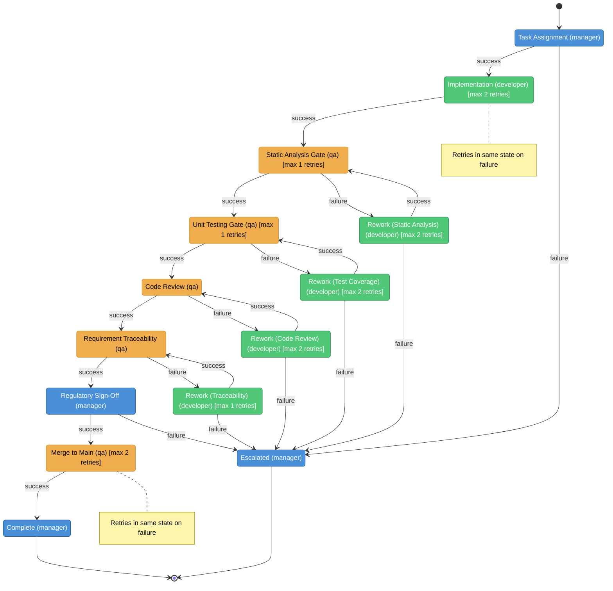
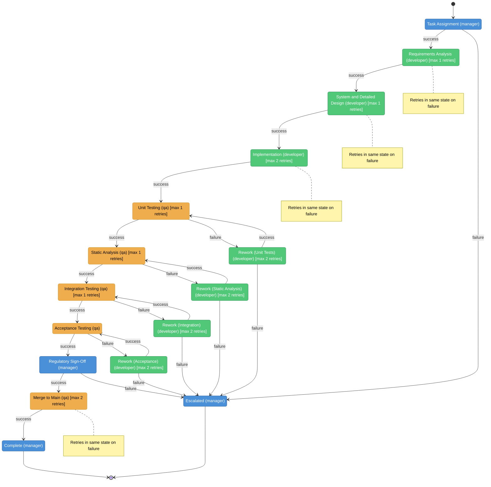

# Workflow State Diagrams

Generated: 2026-02-24

## Development with QA Gate

**ID:** `dev-qa-merge`  
**Version:** 2.0.0  
**Description:** Standard workflow: Manager assigns task, Developer implements on feature branch, QA validates and merges to main.

### Role Legend

| Color | Role |
|-------|------|
|  | manager |
|  | developer |
|  | qa |

### States

| State | Role | Description | Success -> | Failure -> | Retries |
|-------|------|-------------|-----------|-----------|---------|
| ASSIGN | manager | Manager delegates a single task to the developer with clear acceptance criteria | IMPLEMENTING | ESCALATED | - |
| IMPLEMENTING | developer | Developer implements the task on a feature branch from latest main | VALIDATING | IMPLEMENTING | 2 |
| VALIDATING | qa | QA checks out the feature branch and runs build, test, and lint | MERGING | REWORK | 1 |
| REWORK | developer | Developer fixes QA-reported issues on the same feature branch | VALIDATING | ESCALATED | 2 |
| MERGING | qa | QA merges the validated feature branch to main and cleans up | DONE | MERGING | 2 |
| DONE | manager | Task is complete | (terminal) | (terminal) | - |
| ESCALATED | manager | Task failed after max retries | (terminal) | (terminal) | - |

### State Diagram

---

## Regulated Development Pipeline

**ID:** `regulatory`  
**Version:** 2.0.0  
**Description:** Industry safety standards compliant pipeline (e.g., IEC 62304, ISO 26262, DO-178C) with static analysis, coverage gates, code review, requirement traceability, and regulatory sign-off.

### Role Legend

| Color | Role |
|-------|------|
|  | manager |
|  | developer |
|  | qa |

### States

| State | Role | Description | Success -> | Failure -> | Retries |
|-------|------|-------------|-----------|-----------|---------|
| ASSIGN | manager | Manager assigns a task with regulatory requirements and traceability IDs | IMPLEMENTING | ESCALATED | - |
| IMPLEMENTING | developer | Developer implements on a feature branch with safety-critical coding standards | STATIC_ANALYSIS | IMPLEMENTING | 2 |
| STATIC_ANALYSIS | qa | QA runs pedantic static analysis on the feature branch | UNIT_TESTING | REWORK_STATIC | 1 |
| REWORK_STATIC | developer | Developer fixes static analysis issues | STATIC_ANALYSIS | ESCALATED | 2 |
| UNIT_TESTING | qa | QA runs unit tests with coverage verification | CODE_REVIEW | REWORK_TESTS | 1 |
| REWORK_TESTS | developer | Developer adds tests to meet coverage threshold | UNIT_TESTING | ESCALATED | 2 |
| CODE_REVIEW | qa | QA performs detailed code review against coding standards | REQUIREMENT_TRACE | REWORK_REVIEW | - |
| REWORK_REVIEW | developer | Developer addresses code review findings | CODE_REVIEW | ESCALATED | 2 |
| REQUIREMENT_TRACE | qa | QA verifies requirement IDs are traced through code, tests, and commits | REGULATORY_SIGNOFF | REWORK_TRACE | - |
| REWORK_TRACE | developer | Developer adds missing requirement traceability annotations | REQUIREMENT_TRACE | ESCALATED | 1 |
| REGULATORY_SIGNOFF | manager | Manager reviews the full evidence package and signs off for regulatory compliance | MERGING | ESCALATED | - |
| MERGING | qa | QA merges the approved branch to main after manager sign-off | DONE | MERGING | 2 |
| DONE | manager | Task is complete | (terminal) | (terminal) | - |
| ESCALATED | manager | Task failed a regulatory gate after max retries | (terminal) | (terminal) | - |

### State Diagram

---

## V-Model Regulated Development Pipeline

**ID:** `v-model-regulatory`  
**Version:** 2.0.0  
**Description:** Industry safety standards compliant V-model (e.g., IEC 62304, ISO 26262, DO-178C). Left side descends through requirements, design, and implementation. Right side ascends through unit testing, static analysis, integration testing, and acceptance testing -- each level validating the corresponding left-side artifact.

### Role Legend

| Color | Role |
|-------|------|
|  | manager |
|  | developer |
|  | qa |

### States

| State | Role | Description | Success -> | Failure -> | Retries |
|-------|------|-------------|-----------|-----------|---------|
| ASSIGN | manager | Manager assigns a task with requirement IDs, acceptance criteria, and security classification | REQUIREMENTS_ANALYSIS | ESCALATED | - |
| REQUIREMENTS_ANALYSIS | developer | V-model left side (Level 1) | DESIGN | REQUIREMENTS_ANALYSIS | 1 |
| DESIGN | developer | V-model left side (Level 2) | IMPLEMENTING | DESIGN | 1 |
| IMPLEMENTING | developer | V-model bottom | UNIT_TESTING | IMPLEMENTING | 2 |
| UNIT_TESTING | qa | V-model right side (Level 3) | STATIC_ANALYSIS | REWORK_UNIT | 1 |
| REWORK_UNIT | developer | Developer adds missing unit tests or fixes failing tests | UNIT_TESTING | ESCALATED | 2 |
| STATIC_ANALYSIS | qa | QA runs pedantic static analysis, checks unsafe usage, and audits dependencies | INTEGRATION_TESTING | REWORK_STATIC | 1 |
| REWORK_STATIC | developer | Developer fixes static analysis issues | STATIC_ANALYSIS | ESCALATED | 2 |
| INTEGRATION_TESTING | qa | V-model right side (Level 2) | ACCEPTANCE_TESTING | REWORK_INTEGRATION | 1 |
| REWORK_INTEGRATION | developer | Developer fixes integration issues found when modules interact | INTEGRATION_TESTING | ESCALATED | 2 |
| ACCEPTANCE_TESTING | qa | V-model right side (Level 1) | REGULATORY_SIGNOFF | REWORK_ACCEPTANCE | - |
| REWORK_ACCEPTANCE | developer | Developer fixes issues that caused acceptance test failures against requirements | ACCEPTANCE_TESTING | ESCALATED | 2 |
| REGULATORY_SIGNOFF | manager | Manager reviews the full V-model evidence package and signs off for regulatory compliance | MERGING | ESCALATED | - |
| MERGING | qa | QA merges the fully validated branch to main after regulatory sign-off | DONE | MERGING | 2 |
| DONE | manager | Task complete | (terminal) | (terminal) | - |
| ESCALATED | manager | Task failed a V-model gate after max retries | (terminal) | (terminal) | - |

### State Diagram

---

